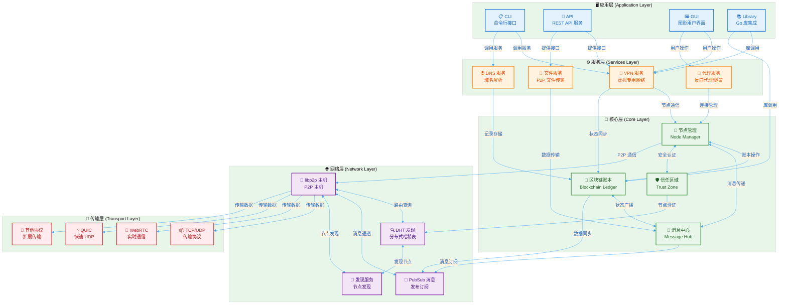
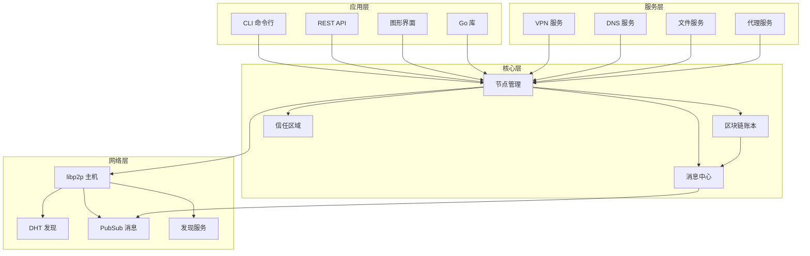
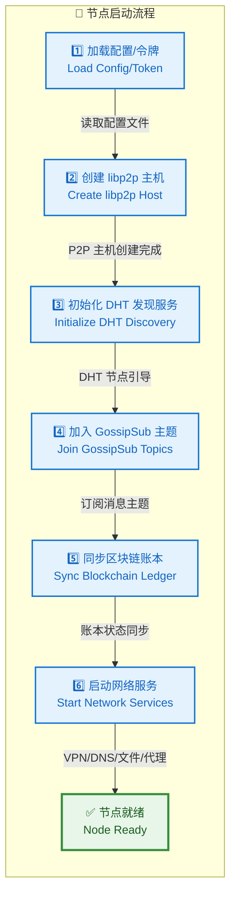
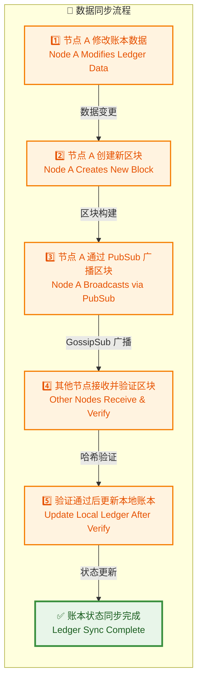
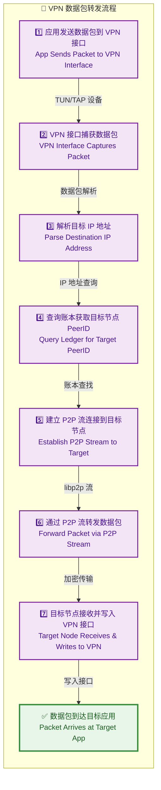
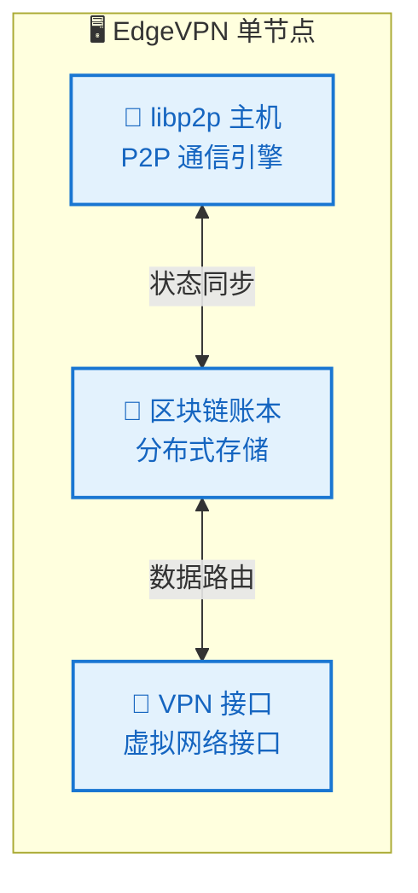
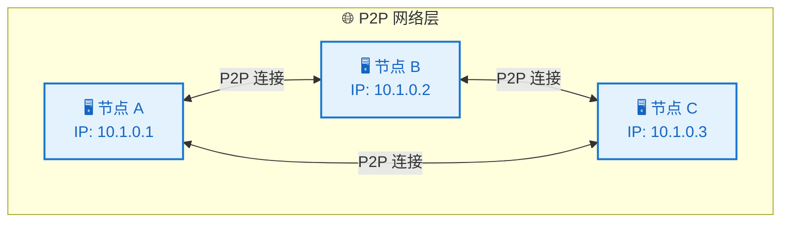
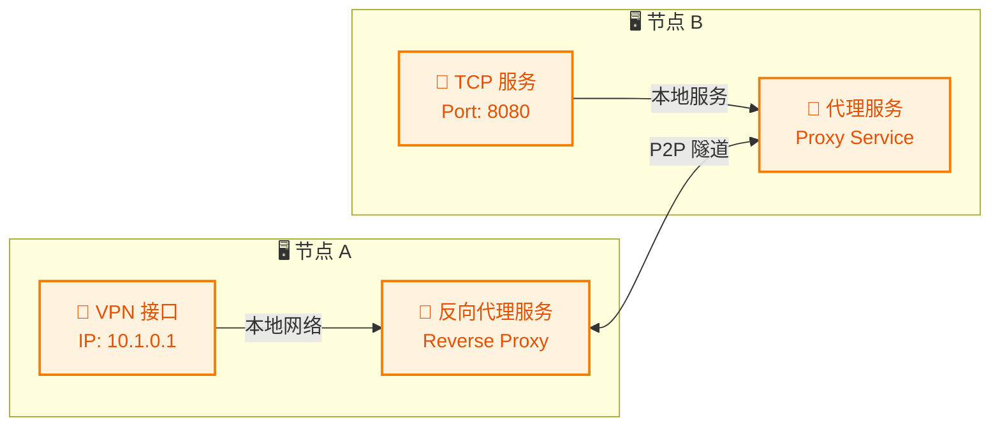

# EdgeVPN 项目架构概述

## 1. 项目简介

EdgeVPN 是一个基于 libp2p 构建的完全去中心化的私有网络解决方案。它使用共享密钥创建可访问的去中心化网络，提供 VPN、反向代理、P2P 文件传输和区块链账本等功能。

### 1.1 核心特性

- **完全去中心化**：无需中央服务器，所有节点对等
- **不可变**：基于区块链的账本系统，确保数据一致性
- **便携**：静态编译的二进制文件，易于部署
- **易于使用**：通过令牌或配置文件快速建立网络

### 1.2 主要功能

- **创建 VPN**：在 P2P 对等节点之间建立安全 VPN
  - 自动为节点分配 IP 地址
  - 内置微型 DNS 服务器用于解析内部/外部 IP
  - 创建可信区域以防止令牌泄露时的网络访问

- **反向代理**：像使用 ngrok 一样共享 TCP 服务
  - 将 TCP 服务暴露给 P2P 网络节点
  - 无需建立 VPN 连接即可实现流量隧道化

- **P2P 文件传输**：在节点之间通过 P2P 发送文件
  - 无需建立 VPN 连接
  - 直接通过 P2P 网络传输

- **区块链账本**：提供分布式账本功能
  - 用于节点发现和服务注册
  - 支持 DNS 记录管理
  - 可作为库集成到其他 Go 应用中

## 2. 系统架构设计

### 2.1 整体架构

EdgeVPN 采用分层架构设计，从底层到上层依次为：

### 2.2 核心组件关系

#### 2.2.1 节点 (Node)

节点是 EdgeVPN 网络的基本单元，每个节点包含：

- **libp2p 主机**：提供 P2P 网络通信能力
- **消息中心**：管理 PubSub 消息传递
- **区块链账本**：维护分布式账本状态
- **连接门控器**：控制对等节点的连接

#### 2.2.2 区块链账本 (Blockchain Ledger)

区块链账本提供：

- **数据存储**：键值对形式的分布式存储
- **状态同步**：通过 GossipSub 协议同步账本状态
- **数据公告**：定期向网络公告数据
- **数据持久化**：支持内存和磁盘存储

#### 2.2.3 消息中心 (Message Hub)

消息中心负责：

- **PubSub 管理**：创建和管理 GossipSub 主题
- **消息路由**：在区块链和公共房间之间路由消息
- **主题管理**：基于 OTP 密钥生成主题密钥

#### 2.2.4 信任区域 (Trust Zone)

信任区域提供：

- **对等节点认证**：支持 ECDSA 等认证机制
- **访问控制**：控制哪些节点可以加入网络
- **自动清理**：清理不活跃的对等节点

### 2.3 技术架构图

## 3. 核心设计原则

### 3.1 去中心化

- **无单点故障**：所有节点功能对等
- **自组织**：网络自动形成和维护
- **抗审查**：无需中央服务器

### 3.2 安全性

- **加密通信**：所有 P2P 通信都经过加密
- **令牌认证**：通过共享密钥控制网络访问
- **信任区域**：可选的对等节点认证机制

### 3.3 可扩展性

- **模块化设计**：各组件独立可替换
- **插件架构**：支持自定义网络服务
- **水平扩展**：节点数量无限制

### 3.4 易用性

- **零配置**：通过令牌快速加入网络
- **自动发现**：节点自动发现和连接
- **跨平台**：支持 Linux、Windows、macOS、FreeBSD

## 4. 数据流设计

### 4.1 节点启动流程

### 4.2 数据同步流程

### 4.3 VPN 数据包转发流程

## 5. 部署架构

### 5.1 单节点部署

### 5.2 多节点网络部署

### 5.3 混合部署（VPN + 服务暴露）

## 6. 安全架构

### 6.1 网络安全

- **TLS 加密**：所有 P2P 连接使用 TLS 加密
- **令牌认证**：通过共享密钥验证网络成员
- **信任区域**：可选的 ECDSA 认证机制

### 6.2 数据安全

- **区块链验证**：所有账本数据通过哈希验证
- **数据加密**：支持 AES 加密存储
- **完整性检查**：区块哈希确保数据完整性

### 6.3 访问控制

- **白名单/黑名单**：控制对等节点连接
- **连接门控**：限制连接数和速率
- **资源限制**：防止资源耗尽攻击

## 7. 性能考虑

### 7.1 网络性能

- **多路复用**：支持多路复用的流连接
- **连接池**：复用 P2P 连接减少开销
- **流管理**：智能流连接管理

### 7.2 存储性能

- **内存缓存**：常用数据内存缓存
- **LRU 缓存**：DNS 记录 LRU 缓存
- **批量操作**：支持批量账本操作

### 7.3 资源优化

- **低配置模式**：减少资源使用
- **连接限制**：控制最大连接数
- **带宽管理**：可选的带宽限制

## 8. 可靠性设计

### 8.1 故障恢复

- **自动重连**：连接断开自动重连
- **状态同步**：节点重新加入自动同步状态
- **数据持久化**：支持磁盘持久化账本

### 8.2 容错机制

- **冗余路由**：DHT 提供冗余路由
- **多路径**：支持多路径数据传输
- **备份节点**：引导节点列表提供备份

## 9. 扩展性设计

### 9.1 水平扩展

- **无中心节点**：节点数量无限制
- **自动发现**：新节点自动加入网络
- **负载均衡**：DHT 自动负载均衡

### 9.2 垂直扩展

- **并发控制**：可配置并发连接数
- **资源调整**：动态调整资源分配
- **性能优化**：支持性能调优

## 10. 监控和运维

### 10.1 监控指标

- **连接统计**：节点连接数和状态
- **带宽使用**：上传/下载带宽统计
- **账本状态**：区块链高度和大小
- **服务状态**：各服务运行状态

### 10.2 日志记录

- **结构化日志**：使用 zap 结构化日志
- **日志级别**：支持多级别日志
- **日志轮转**：支持日志文件轮转

### 10.3 健康检查

- **接口检查**：VPN 接口状态检查
- **连接检查**：P2P 连接状态检查
- **服务检查**：各服务健康状态检查

## 11. 总结

EdgeVPN 采用现代化的去中心化架构设计，基于 libp2p 提供强大的 P2P 网络能力。通过分层架构、模块化设计和完善的机制，实现了安全、可靠、可扩展的去中心化网络解决方案。系统设计充分考虑了易用性、性能和可维护性，为用户提供了灵活的网络构建工具。
