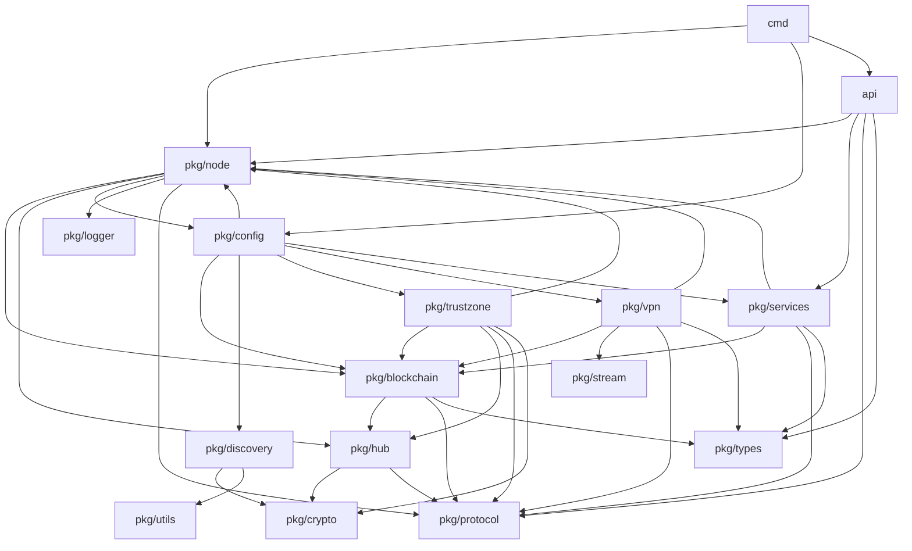

# EdgeVPN 模块划分

## 1. 概述

EdgeVPN 采用模块化设计，将系统划分为多个功能模块，每个模块负责特定的功能领域。这种设计提高了代码的可维护性、可测试性和可扩展性。本文档详细说明各模块的职责、接口和交互关系。

## 2. 模块架构

### 2.1 模块层次结构

```
EdgeVPN
├── cmd (命令行模块)
│   ├── main.go (主入口)
│   ├── service.go (服务管理)
│   ├── proxy.go (代理功能)
│   ├── peergate.go (对等网关)
│   ├── join.go (网络加入)
│   ├── file.go (文件传输)
│   ├── dns.go (DNS 服务)
│   └── api.go (API 服务)
├── pkg (核心包)
│   ├── node (节点管理)
│   ├── blockchain (区块链账本)
│   ├── hub (消息中心)
│   ├── services (网络服务)
│   ├── vpn (VPN 功能)
│   ├── discovery (节点发现)
│   ├── trustzone (信任区域)
│   ├── crypto (加密功能)
│   ├── stream (流管理)
│   ├── types (数据类型)
│   ├── config (配置管理)
│   ├── logger (日志记录)
│   ├── protocol (协议定义)
│   └── utils (工具函数)
├── api (API 模块)
│   ├── api.go (API 服务器)
│   ├── client (客户端库)
│   ├── types (API 类型)
│   └── generate (代码生成)
└── internal (内部包)
    └── version.go (版本信息)
```

## 3. 核心模块详解

### 3.1 cmd 模块

#### 3.1.1 职责

- 提供命令行界面
- 解析用户命令和参数
- 协调各模块的启动和运行
- 处理用户输入和输出

#### 3.1.2 主要组件

| 文件 | 功能 | 说明 |
|------|------|------|
| main.go | 主入口 | 应用程序入口点 |
| service.go | 服务管理 | 服务添加和连接命令 |
| proxy.go | 代理功能 | 反向代理命令 |
| peergate.go | 对等网关 | 对等网关管理 |
| join.go | 网络加入 | 加入 P2P 网络 |
| file.go | 文件传输 | 文件发送和接收 |
| dns.go | DNS 服务 | DNS 查询和管理 |
| api.go | API 服务 | REST API 启动 |
| util.go | 工具函数 | 通用工具函数 |

#### 3.1.3 接口定义

```go
// 命令行接口
type Command struct {
    Name        string
    Usage       string
    Description string
    Flags       []cli.Flag
    Action      func(c *cli.Context) error
}

// 服务命令接口
type ServiceCommand interface {
    Start() error
    Stop() error
    Status() error
}
```

#### 3.1.4 依赖关系

```
cmd
├── pkg/node (节点管理)
├── pkg/config (配置)
├── pkg/services (服务)
├── api (API)
└── internal (内部)
```

### 3.2 pkg/node 模块

#### 3.2.1 职责

- 管理 libp2p 节点生命周期
- 协调各子模块的启动和停止
- 提供节点配置和选项
- 管理节点间的连接

#### 3.2.2 主要组件

| 文件 | 功能 | 说明 |
|------|------|------|
| node.go | 节点核心 | 节点主结构和方法 |
| config.go | 配置管理 | 节点配置定义 |
| connection.go | 连接管理 | 对等节点连接 |
| message.go | 消息处理 | 消息接收和发送 |
| options.go | 选项模式 | 节点配置选项 |

#### 3.2.3 接口定义

```go
// 节点接口
type Node struct {
    config     Config
    MessageHub *hub.MessageHub
    host       host.Host
    ledger     *blockchain.Ledger
    // ...
}

// 网络服务接口
type NetworkService func(ctx context.Context, c Config, n *Node, b *blockchain.Ledger) error

// 流处理器接口
type StreamHandler func(n *Node, l *blockchain.Ledger) func(stream network.Stream)
```

#### 3.2.4 依赖关系

```
pkg/node
├── pkg/blockchain (区块链)
├── pkg/hub (消息中心)
├── pkg/config (配置)
├── pkg/logger (日志)
├── libp2p (外部库)
└── pkg/protocol (协议)
```

### 3.3 pkg/blockchain 模块

#### 3.3.1 职责

- 实现分布式区块链账本
- 管理区块的创建和验证
- 提供数据存储和检索
- 同步账本状态

#### 3.3.2 主要组件

| 文件 | 功能 | 说明 |
|------|------|------|
| block.go | 区块定义 | 区块结构和验证 |
| data.go | 数据管理 | 数据存储和检索 |
| ledger.go | 账本管理 | 账本核心逻辑 |
| store_disk.go | 磁盘存储 | 持久化存储 |
| store_memory.go | 内存存储 | 内存存储实现 |

#### 3.3.3 接口定义

```go
// 区块接口
type Block struct {
    Index     int
    Timestamp string
    Storage   map[string]map[string]Data
    Hash      string
    PrevHash  string
}

// 账本接口
type Ledger struct {
    blockchain Blockchain
    store      Store
    // ...
}

// 存储接口
type Store interface {
    Get(key string) ([]byte, error)
    Set(key string, value []byte) error
    Delete(key string) error
}
```

#### 3.3.4 依赖关系

```
pkg/blockchain
├── pkg/hub (消息中心)
├── pkg/protocol (协议)
└── pkg/types (数据类型)
```

### 3.4 pkg/hub 模块

#### 3.4.1 职责

- 管理 PubSub 消息传递
- 创建和管理主题
- 路由消息到处理器
- 处理消息加密和解密

#### 3.4.2 主要组件

| 文件 | 功能 | 说明 |
|------|------|------|
| hub.go | 消息中心 | 消息中心核心 |
| room.go | 房间管理 | 主题房间 |
| message.go | 消息定义 | 消息结构 |

#### 3.4.3 接口定义

```go
// 消息中心接口
type MessageHub struct {
    blockchain, public *room
    ps               *pubsub.PubSub
    Messages         chan *Message
    PublicMessages   chan *Message
}

// 消息接口
type Message struct {
    SenderID  string
    Payload   []byte
    Timestamp time.Time
}

// 房间接口
type room struct {
    topic *pubsub.Topic
    // ...
}
```

#### 3.4.4 依赖关系

```
pkg/hub
├── pkg/crypto (加密)
├── libp2p-pubsub (外部库)
└── pkg/protocol (协议)
```

### 3.5 pkg/services 模块

#### 3.5.1 职责

- 提供各种网络服务
- 管理 VPN、DNS、文件传输等服务
- 处理服务注册和发现
- 协调服务间的交互

#### 3.5.2 主要组件

| 文件 | 功能 | 说明 |
|------|------|------|
| services.go | 服务管理 | 服务基础功能 |
| vpn.go | VPN 服务 | VPN 数据转发 |
| dns.go | DNS 服务 | DNS 解析和转发 |
| files.go | 文件服务 | 文件传输 |
| egress.go | 出口服务 | 出口流量处理 |
| alive.go | 存活服务 | 节点存活检测 |

#### 3.5.3 接口定义

```go
// VPN 服务接口
func VPNNetworkService(p ...Option) node.NetworkService

// DNS 服务接口
func DNSNetworkService(ll log.StandardLogger, listenAddr string, forwarder bool, forward []string, cacheSize int) node.NetworkService

// 文件服务接口
func SharefileNetworkService(announcetime time.Duration, fileID string) node.NetworkService

// 服务注册接口
func RegisterService(ll log.StandardLogger, announcetime time.Duration, serviceID, dstaddress string) []node.Option
```

#### 3.5.4 依赖关系

```
pkg/services
├── pkg/node (节点)
├── pkg/blockchain (区块链)
├── pkg/protocol (协议)
├── pkg/types (数据类型)
├── libp2p (外部库)
└── miekg/dns (外部库)
```

### 3.6 pkg/vpn 模块

#### 3.6.1 职责

- 创建和管理虚拟网络接口
- 捕获和转发网络数据包
- 处理数据包路由
- 管理 VPN 连接

#### 3.6.2 主要组件

| 文件 | 功能 | 说明 |
|------|------|------|
| vpn.go | VPN 核心 | VPN 主要逻辑 |
| interface.go | 接口管理 | 网络接口操作 |
| dhcp.go | DHCP 服务 | IP 地址分配 |
| config.go | 配置管理 | VPN 配置 |
| interface_darwin.go | Darwin 接口 | macOS 平台 |
| interface_freebsd.go | FreeBSD 接口 | FreeBSD 平台 |
| interface_windows.go | Windows 接口 | Windows 平台 |

#### 3.6.3 接口定义

```go
// VPN 配置接口
type Config struct {
    InterfaceAddress string
    InterfaceMTU    int
    PacketMTU       int
    MaxStreams      int
    // ...
}

// 流管理器接口
type streamManager interface {
    Connected(n network.Network, c network.Stream)
    Disconnected(n network.Network, c network.Stream)
    HasStream(n network.Network, pid peer.ID) (network.Stream, error)
    Close() error
}
```

#### 3.6.4 依赖关系

```
pkg/vpn
├── pkg/node (节点)
├── pkg/blockchain (区块链)
├── pkg/stream (流管理)
├── pkg/types (数据类型)
├── pkg/protocol (协议)
├── libp2p (外部库)
├── google/gopacket (外部库)
└── mudler/water (外部库)
```

### 3.7 pkg/discovery 模块

#### 3.7.1 职责

- 实现节点发现机制
- 管理 DHT 发现
- 处理 mDNS 发现
- 管理引导节点

#### 3.7.2 主要组件

| 文件 | 功能 | 说明 |
|------|------|------|
| dht.go | DHT 发现 | Kademlia DHT |
| mdns.go | mDNS 发现 | 多播 DNS |
| ring.go | 环形缓冲 | 发现历史 |
| address.go | 地址管理 | 地址解析 |

#### 3.7.3 接口定义

```go
// DHT 发现接口
type DHT struct {
    OTPKey               string
    OTPInterval          int
    RendezvousString     string
    BootstrapPeers       AddrList
    *dht.IpfsDHT
}

// 发现服务接口
type DiscoveryService interface {
    Discover(ctx context.Context, host host.Host) error
    Announce(ctx context.Context, host host.Host) error
}
```

#### 3.7.4 依赖关系

```
pkg/discovery
├── pkg/crypto (加密)
├── pkg/utils (工具)
├── libp2p-kad-dht (外部库)
└── libp2p (外部库)
```

### 3.8 pkg/trustzone 模块

#### 3.8.1 职责

- 实现对等节点认证
- 管理信任区域
- 处理认证挑战
- 控制节点访问

#### 3.8.2 主要组件

| 文件 | 功能 | 说明 |
|------|------|------|
| peerguardian.go | 对等守护 | 认证管理 |
| peergater.go | 对等网关 | 连接控制 |
| authprovider/ecdsa/provider.go | ECDSA 认证 | ECDSA 实现 |
| authprovider/ecdsa/crypto.go | 加密工具 | 加密功能 |

#### 3.8.3 接口定义

```go
// 对等守护接口
type PeerGuardian struct {
    authProviders []AuthProvider
    logger        log.StandardLogger
}

// 认证提供者接口
type AuthProvider interface {
    Authenticate(m *hub.Message, c chan *hub.Message, trustAuth map[string]Data) bool
    Challenger(exists bool, c node.Config, n *node.Node, b *blockchain.Ledger, trustAuth map[string]Data)
}
```

#### 3.8.4 依赖关系

```
pkg/trustzone
├── pkg/node (节点)
├── pkg/blockchain (区块链)
├── pkg/hub (消息中心)
├── pkg/protocol (协议)
└── pkg/crypto (加密)
```

### 3.9 pkg/crypto 模块

#### 3.9.1 职责

- 提供加密功能
- 实现 OTP 算法
- 处理数据加密和解密
- 生成密钥和哈希

#### 3.9.2 主要组件

| 文件 | 功能 | 说明 |
|------|------|------|
| aes.go | AES 加密 | AES 算法实现 |
| otp.go | OTP 算法 | 一次性密码 |
| md5.go | MD5 哈希 | MD5 哈希计算 |
| sealer_aes.go | AES 密封 | 数据密封 |

#### 3.9.3 接口定义

```go
// 密封器接口
type Sealer interface {
    Seal(data []byte, key []byte) ([]byte, error)
    Unseal(data []byte, key []byte) ([]byte, error)
}

// AES 密封器
type AESSealer struct {
    key []byte
}
```

#### 3.9.4 依赖关系

```
pkg/crypto
├── creachadair/otp (外部库)
└── 标准库 (crypto)
```

### 3.10 pkg/stream 模块

#### 3.10.1 职责

- 管理 P2P 流连接
- 处理流生命周期
- 实现连接池
- 管理流衰减

#### 3.10.2 主要组件

| 文件 | 功能 | 说明 |
|------|------|------|
| manager.go | 流管理器 | 流连接管理 |
| decay.go | 衰减管理 | 连接衰减 |
| options.go | 选项配置 | 流配置选项 |

#### 3.10.3 接口定义

```go
// 流管理器接口
type ConnManager struct {
    maxConnections int
    maxStreams    int
    // ...
}

// 流选项
type Option func(*ConnManager)
```

#### 3.10.4 依赖关系

```
pkg/stream
├── libp2p (外部库)
└── pkg/utils (工具)
```

### 3.11 pkg/types 模块

#### 3.11.1 职责

- 定义数据类型
- 提供数据结构
- 实现序列化和反序列化
- 管理类型转换

#### 3.11.2 主要组件

| 文件 | 功能 | 说明 |
|------|------|------|
| machine.go | 机器类型 | 机器信息 |
| user.go | 用户类型 | 用户信息 |
| service.go | 服务类型 | 服务信息 |
| dns.go | DNS 类型 | DNS 记录 |
| file.go | 文件类型 | 文件信息 |
| summary.go | 摘要类型 | 网络摘要 |

#### 3.11.3 接口定义

```go
// 机器类型
type Machine struct {
    PeerID    string
    IP        string
    Hostname  string
    Timestamp time.Time
}

// 用户类型
type User struct {
    PeerID    string
    Username  string
    Timestamp time.Time
}

// 服务类型
type Service struct {
    PeerID    string
    Name      string
    Address   string
    Timestamp time.Time
}
```

#### 3.11.4 依赖关系

```
pkg/types
└── 无外部依赖
```

### 3.12 pkg/config 模块

#### 3.12.1 职责

- 管理配置加载和解析
- 提供配置验证
- 处理环境变量
- 生成节点选项

#### 3.12.2 主要组件

| 文件 | 功能 | 说明 |
|------|------|------|
| config.go | 配置管理 | 配置定义和加载 |

#### 3.12.3 接口定义

```go
// 配置结构
type Config struct {
    NetworkConfig, NetworkToken string
    Address                 string
    ListenMaddrs            []string
    Interface               string
    // ...
}

// 配置选项
func (c *Config) ToOptions() ([]node.Option, error)
```

#### 3.12.4 依赖关系

```
pkg/config
├── pkg/node (节点)
├── pkg/blockchain (区块链)
├── pkg/discovery (发现)
├── pkg/trustzone (信任区域)
├── pkg/vpn (VPN)
├── pkg/services (服务)
└── libp2p (外部库)
```

### 3.13 pkg/logger 模块

#### 3.13.1 职责

- 提供日志记录功能
- 管理日志级别
- 处理日志输出
- 支持结构化日志

#### 3.13.2 主要组件

| 文件 | 功能 | 说明 |
|------|------|------|
| logger.go | 日志管理 | 日志记录器 |

#### 3.13.3 接口定义

```go
// 日志记录器
func New(level log.Level) log.StandardLogger

// 日志级别
const (
    LevelDebug = iota
    LevelInfo
    LevelWarn
    LevelError
    LevelFatal
)
```

#### 3.13.4 依赖关系

```
pkg/logger
├── ipfs/go-log (外部库)
└── go.uber.org/zap (外部库)
```

### 3.14 pkg/protocol 模块

#### 3.14.1 职责

- 定义协议常量
- 管理协议 ID
- 提供协议工具

#### 3.14.2 主要组件

| 文件 | 功能 | 说明 |
|------|------|------|
| protocol.go | 协议定义 | 协议常量 |

#### 3.14.3 接口定义

```go
// 协议类型
type Protocol string

// 协议常量
const (
    EdgeVPN         Protocol = "/edgevpn/0.1"
    ServiceProtocol  Protocol = "/edgevpn/service/0.1"
    FileProtocol     Protocol = "/edgevpn/file/0.1"
    EgressProtocol  Protocol = "/edgevpn/egress/0.1"
)

// 账本键常量
const (
    FilesLedgerKey    = "files"
    MachinesLedgerKey = "machines"
    ServicesLedgerKey = "services"
    UsersLedgerKey    = "users"
    // ...
)
```

#### 3.14.4 依赖关系

```
pkg/protocol
└── libp2p (外部库)
```

### 3.15 pkg/utils 模块

#### 3.15.1 职责

- 提供通用工具函数
- 实现 IP 地址操作
- 管理领导选举
- 处理字符串操作

#### 3.15.2 主要组件

| 文件 | 功能 | 说明 |
|------|------|------|
| ip.go | IP 工具 | IP 地址操作 |
| leader.go | 领导选举 | 分布式选举 |
| strings.go | 字符串工具 | 字符串处理 |
| ticker.go | 定时器 | 定时任务 |

#### 3.15.3 接口定义

```go
// IP 工具函数
func GetAvailableIP(cidr string, used []string) (string, error)

// 领导选举
func LeaderElection(peers []string, self string) bool

// 字符串工具
func Contains(slice []string, item string) bool
```

#### 3.15.4 依赖关系

```
pkg/utils
└── c-robinson/iplib (外部库)
```

### 3.16 api 模块

#### 3.16.1 职责

- 提供 REST API 服务
- 管理客户端连接
- 处理 API 请求
- 提供 Web 界面

#### 3.16.2 主要组件

| 文件 | 功能 | 说明 |
|------|------|------|
| api.go | API 服务器 | REST API 实现 |
| client/client.go | 客户端库 | API 客户端 |
| client/service/ | 服务客户端 | 服务相关 API |
| types/ | API 类型 | API 数据类型 |
| generate/ | 代码生成 | API 代码生成 |

#### 3.16.3 接口定义

```go
// API 服务器
func API(ctx context.Context, l string, defaultInterval, timeout time.Duration, e *node.Node, bwc metrics.Reporter, debugMode bool) error

// API 端点
const (
    MachineURL    = "/api/machines"
    UsersURL      = "/api/users"
    ServiceURL    = "/api/services"
    BlockchainURL = "/api/blockchain"
    LedgerURL     = "/api/ledger"
    SummaryURL    = "/api/summary"
    FileURL       = "/api/files"
    NodesURL      = "/api/nodes"
    DNSURL        = "/api/dns"
    MetricsURL    = "/api/metrics"
    PeerstoreURL  = "/api/peerstore"
    PeerGateURL   = "/api/peergate"
)
```

#### 3.16.4 依赖关系

```
api
├── pkg/node (节点)
├── pkg/services (服务)
├── pkg/protocol (协议)
├── pkg/types (数据类型)
├── labstack/echo/v4 (外部库)
└── miekg/dns (外部库)
```

## 4. 模块交互关系

### 4.1 启动流程

```
1. cmd/main.go
   ↓
2. cmd/util.go (加载配置)
   ↓
3. pkg/config/config.go (解析配置)
   ↓
4. pkg/node/node.go (创建节点)
   ↓
5. pkg/discovery/dht.go (启动发现)
   ↓
6. pkg/hub/hub.go (加入主题)
   ↓
7. pkg/blockchain/ledger.go (同步账本)
   ↓
8. pkg/services/ (启动服务)
   ↓
9. api/api.go (启动 API)
```

### 4.2 数据流转

```
应用 → pkg/vpn → pkg/node → libp2p → 网络
                     ↓
              pkg/blockchain → pkg/hub → libp2p-pubsub
```

### 4.3 消息流转

```
libp2p-pubsub → pkg/hub → pkg/node → pkg/services
                              ↓
                         pkg/trustzone
```

## 5. 模块依赖图



## 6. 模块设计原则

### 6.1 单一职责原则

每个模块只负责一个功能领域，职责清晰明确。

### 6.2 开闭原则

模块对扩展开放，对修改关闭，通过接口和选项模式实现。

### 6.3 依赖倒置原则

高层模块不依赖低层模块，都依赖抽象接口。

### 6.4 接口隔离原则

客户端不应该依赖它不需要的接口，接口应该小而专一。

## 7. 模块扩展性

### 7.1 添加新服务

1. 在 `pkg/services` 中创建新的服务文件
2. 实现 `NetworkService` 接口
3. 在 `pkg/protocol` 中定义新协议
4. 在 `cmd` 中添加命令行支持

### 7.2 添加新发现机制

1. 在 `pkg/discovery` 中创建新的发现实现
2. 实现发现接口
3. 在 `pkg/config` 中添加配置选项

### 7.3 添加新认证方式

1. 在 `pkg/trustzone/authprovider` 中创建新的认证提供者
2. 实现 `AuthProvider` 接口
3. 在 `pkg/config` 中添加配置

## 8. 总结

EdgeVPN 采用模块化设计，将系统划分为多个功能清晰的模块。每个模块都有明确的职责和接口定义，模块间通过接口进行交互，降低了耦合度。这种设计使得系统易于理解、测试、维护和扩展，为未来的功能增强提供了良好的基础。
