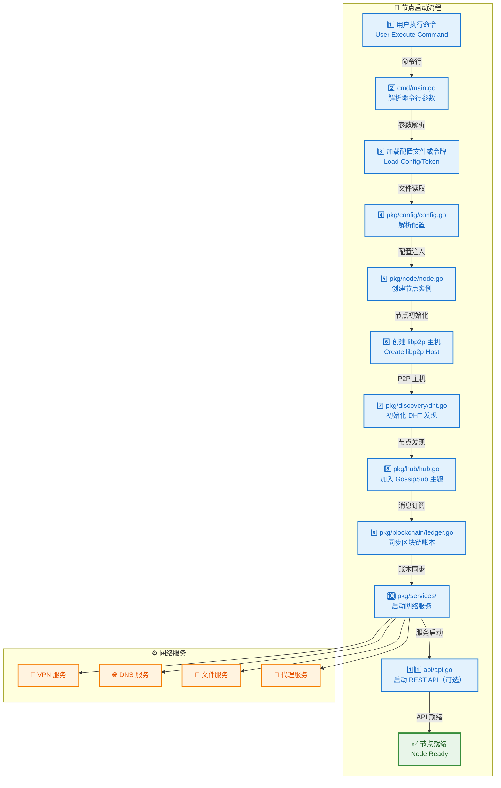
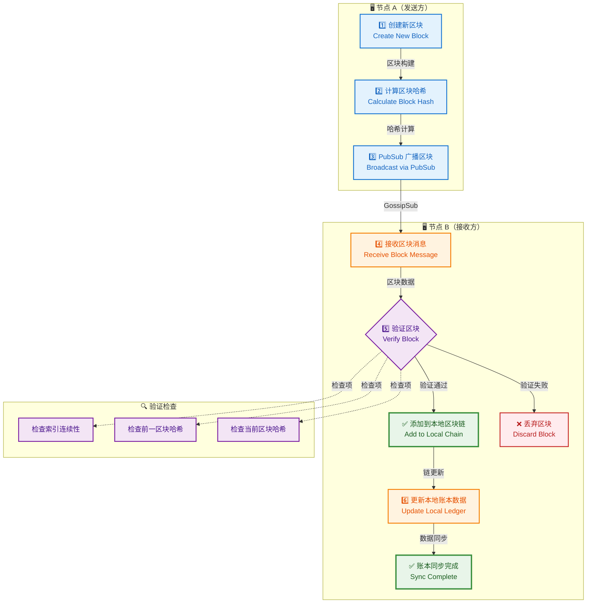
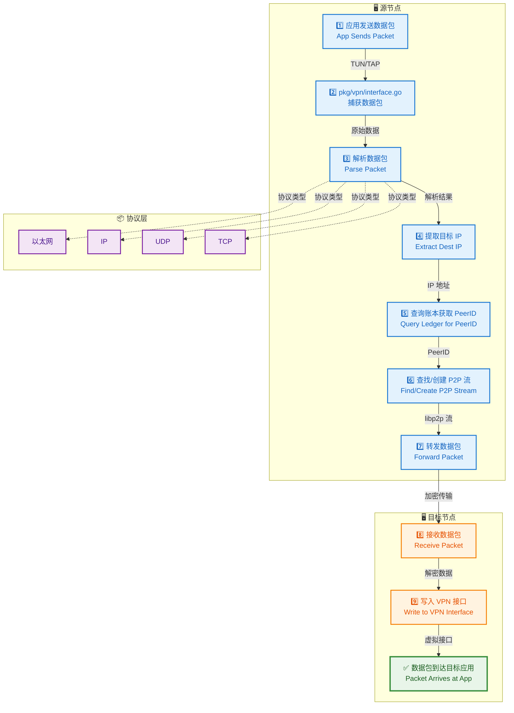
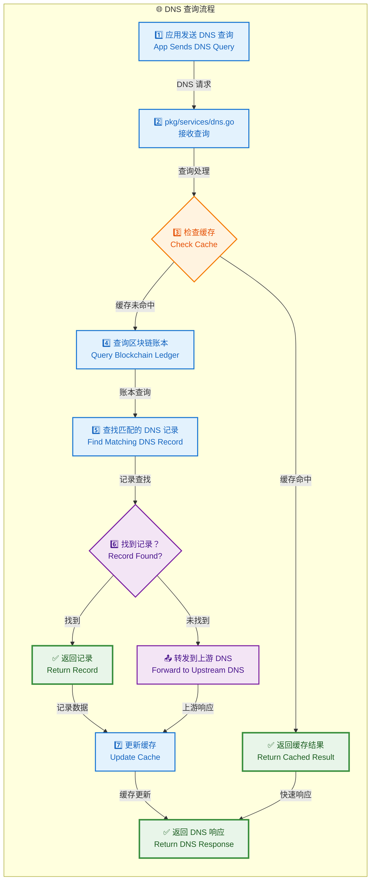
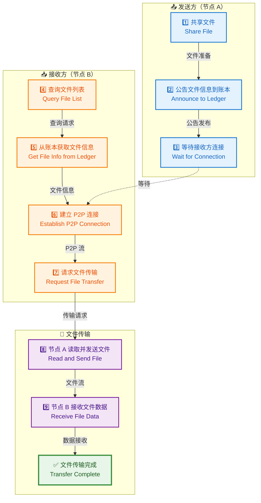
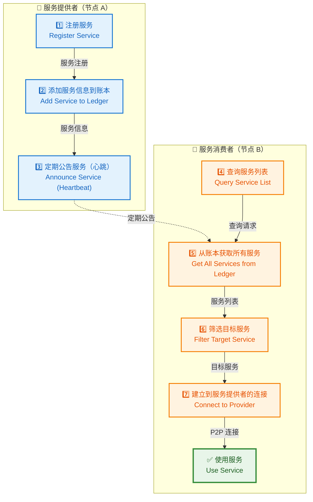
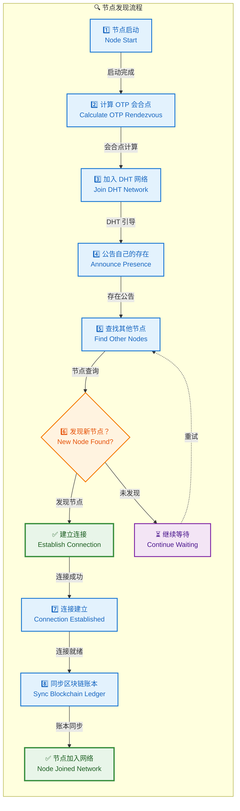
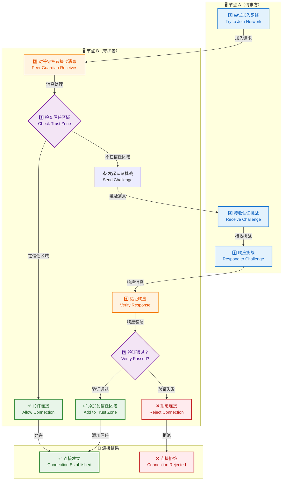
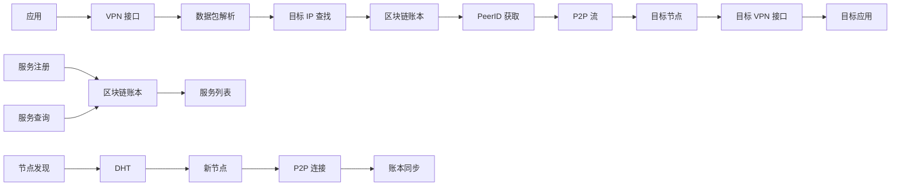
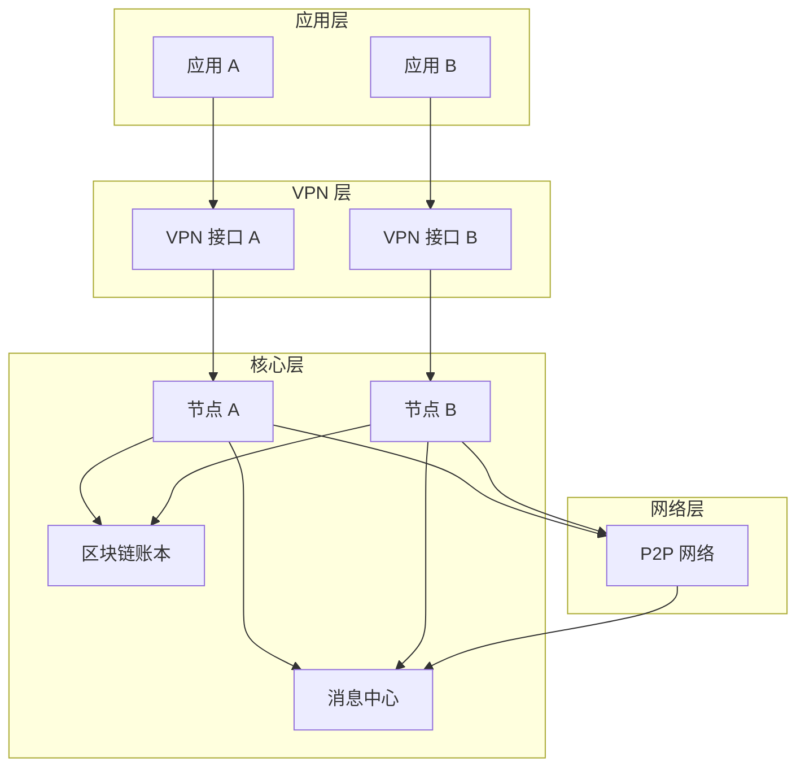

# EdgeVPN 数据流程

## 1. 概述

EdgeVPN 的数据流程涉及多个模块之间的协作，包括节点启动、数据同步、VPN 数据包转发、服务发现等关键业务流程。本文档详细说明这些关键业务流程的数据流转过程。

## 2. 节点启动流程

### 2.1 流程图



### 2.2 详细说明

#### 步骤 1-3：命令解析和配置加载

```go
// cmd/main.go
func main() {
    app := &cli.App{
        Name:    "edgevpn",
        Version: internal.Version,
        Flags:   cmd.MainFlags(),
        Commands: []*cli.Command{
            cmd.Start(),
            cmd.API(),
            // ...
        },
        Action: cmd.Main(),
    }
    app.Run(os.Args)
}
```

**数据流转**：
- 命令行参数 → CLI 解析器
- 配置文件/令牌 → 配置解析器
- 环境变量 → 配置合并

#### 步骤 4-6：节点创建

```go
// pkg/node/node.go
func New(p ...Option) (*Node, error) {
    c := &Config{
        DiscoveryInterval: 5 * time.Minute,
        StreamHandlers:    make(map[protocol.Protocol]StreamHandler),
        LedgerAnnounceTime: 5 * time.Second,
        // ...
    }
    c.Apply(p...)
    return &Node{config: *c}, nil
}
```

**数据流转**：
- 配置选项 → 节点配置
- 节点配置 → libp2p 主机选项
- libp2p 选项 → libp2p 主机实例

#### 步骤 7-9：网络初始化

```go
// pkg/discovery/dht.go
func (d *DHT) startDHT(ctx context.Context, h host.Host) (*dht.IpfsDHT, error) {
    kad, err := dht.New(ctx, h, d.dhtOptions...)
    if err != nil {
        return d.IpfsDHT, err
    }
    d.IpfsDHT = kad
    return d.IpfsDHT, nil
}
```

**数据流转**：
- OTP 密钥 → 会合点字符串
- 会合点字符串 → DHT 主题
- DHT 主题 → 节点发现

#### 步骤 10-12：服务启动

```go
// pkg/services/services.go
func VPNNetworkService(p ...Option) node.NetworkService {
    return func(ctx context.Context, nc node.Config, n *node.Node, b *blockchain.Ledger) error {
        // 创建 VPN 接口
        ifce, err := createInterface(c)
        // 设置流处理器
        n.Host().SetStreamHandler(protocol.EdgeVPN.ID(), streamHandler(b, ifce, c, nc))
        // 公告 IP 地址
        b.Announce(ctx, announcetime, func() {
            // 公告逻辑
        })
        return nil
    }
}
```

**数据流转**：
- 服务配置 → 网络服务
- 网络服务 → 流处理器
- 流处理器 → libp2p 主机

## 3. 区块链同步流程

### 3.1 流程图



### 3.2 详细说明

#### 步骤 1-3：区块创建和广播

```go
// pkg/blockchain/block.go
func (oldBlock Block) NewBlock(s map[string]map[string]Data) Block {
    var newBlock Block
    t := time.Now().UTC()
    newBlock.Index = oldBlock.Index + 1
    newBlock.Timestamp = t.String()
    newBlock.Storage = s
    newBlock.PrevHash = oldBlock.Hash
    newBlock.Hash = newBlock.Checksum()
    return newBlock
}
```

**数据流转**：
- 存储数据 → 区块数据
- 区块数据 → SHA256 哈希
- 区块 → PubSub 消息

#### 步骤 4-6：区块接收和验证

```go
// pkg/blockchain/ledger.go
func (l *Ledger) ReceiveMessage(m *hub.Message, c chan *hub.Message) error {
    var block Block
    json.Unmarshal(m.Payload, &block)

    // 验证区块
    if !block.IsValid(l.blockchain[len(l.blockchain)-1]) {
        return errors.New("Invalid block")
    }

    // 添加到区块链
    l.blockchain = append(l.blockchain, block)

    // 更新存储
    for k, v := range block.Storage {
        l.store[k] = v
    }

    return nil
}
```

**数据流转**：
- PubSub 消息 → 区块对象
- 区块对象 → 验证逻辑
- 验证结果 → 区块链/存储

## 4. VPN 数据包转发流程

### 4.1 流程图



### 4.2 详细说明

#### 步骤 1-4：数据包捕获和解析

```go
// pkg/vpn/vpn.go
func streamHandler(b *blockchain.Ledger, ifce *water.Interface, c *Config, nc node.Config) func(stream network.Stream) {
    return func(stream network.Stream) {
        // 读取 VPN 接口数据包
        packet := make([]byte, ifce.MTU())
        n, err := ifce.Read(packet)
        if err != nil {
            return
        }

        // 解析数据包
        packet = packet[:n]
        ethPacket := gopacket.NewPacket(packet, layers.LayerTypeEthernet, gopacket.Default)

        // 提取 IP 层
        ipLayer := ethPacket.Layer(layers.LayerTypeIPv4)
        if ipLayer == nil {
            return
        }
        ip, _ := ipLayer.(*layers.IPv4)

        // 获取目标 IP
        dstIP := ip.DstIP.String()
    }
}
```

**数据流转**：
- VPN 接口 → 原始数据包
- 原始数据包 → gopacket 解析器
- 解析器 → IP 层对象
- IP 层 → 目标 IP 地址

#### 步骤 5-7：节点查找和转发

```go
// pkg/vpn/vpn.go
func forwardPacket(dstIP string, b *blockchain.Ledger, n *node.Node) error {
    // 查询账本获取目标节点
    machines := b.CurrentData()[protocol.MachinesLedgerKey]
    var targetPeerID string
    for k, v := range machines {
        machine := &types.Machine{}
        v.Unmarshal(machine)
        if machine.IP == dstIP {
            targetPeerID = k
            break
        }
    }

    if targetPeerID == "" {
        return errors.New("Target not found")
    }

    // 获取或创建流
    stream, err := n.Host().NewStream(context.Background(), peer.ID(targetPeerID), protocol.EdgeVPN.ID())
    if err != nil {
        return err
    }

    // 转发数据包
    _, err = stream.Write(packet)
    return err
}
```

**数据流转**：
- 目标 IP → 账本查询
- 账本数据 → PeerID
- PeerID → P2P 流
- 数据包 → P2P 流

## 5. DNS 查询流程

### 5.1 流程图



### 5.2 详细说明

#### 步骤 1-4：DNS 查询接收

```go
// pkg/services/dns.go
func (d dnsHandler) handleDNSRequest() func(w dns.ResponseWriter, r *dns.Msg) {
    return func(w dns.ResponseWriter, r *dns.Msg) {
        // 检查缓存
        key := fmt.Sprintf("%s:%s", r.Question[0].Name, r.Question[0].Qtype)
        if cached, ok := d.cache.Get(key); ok {
            w.WriteMsg(cached.(*dns.Msg))
            return
        }

        // 查询区块链
        response := d.parseQuery(r, false)

        // 更新缓存
        d.cache.Add(key, response)

        // 返回响应
        w.WriteMsg(response)
    }
}
```

**数据流转**：
- DNS 查询 → DNS 处理器
- DNS 处理器 → 缓存检查
- 缓存未命中 → 账本查询

#### 步骤 5-8：记录查找和响应

```go
// pkg/services/dns.go
func (d dnsHandler) parseQuery(m *dns.Msg, forward bool) *dns.Msg {
    response := m.Copy()
    if len(m.Question) > 0 {
        q := m.Question[0]

        // 从区块链查找记录
        for k, v := range d.b.CurrentData()[protocol.DNSKey] {
            r, err := regexp.Compile(k)
            if err != nil {
                continue
            }
            if r.MatchString(q.Name) {
                dnsRecord := &types.DNS{}
                v.Unmarshal(dnsRecord)

                // 构造 DNS 响应
                rr, err := dns.NewRR(
                    fmt.Sprintf("%s %d IN %s %s",
                        q.Name, dnsRecord.TTL, dnsRecord.Type, dnsRecord.Value),
                )
                if err == nil {
                    response.Answer = append(response.Answer, rr)
                }
            }
        }

        // 如果没有找到且启用了转发
        if len(response.Answer) == 0 && forward {
            // 转发到上游 DNS
            return d.forwardQuery(m)
        }
    }
    return response
}
```

**数据流转**：
- DNS 问题 → 正则表达式匹配
- 匹配结果 → DNS 记录
- DNS 记录 → DNS 响应
- DNS 响应 → 客户端

## 6. 文件传输流程

### 6.1 流程图



### 6.2 详细说明

#### 发送方：文件共享

```go
// pkg/services/files.go
func ShareFile(ll log.StandardLogger, announcetime time.Duration, fileID, filepath string) ([]node.Option, error) {
    // 验证文件存在
    _, err := os.Stat(filepath)
    if err != nil {
        return nil, err
    }

    return []node.Option{
        node.WithNetworkService(
            SharefileNetworkService(announcetime, fileID),
        ),
        node.WithStreamHandler(protocol.FileProtocol,
            func(n *node.Node, l *blockchain.Ledger) func(stream network.Stream) {
                return func(stream network.Stream) {
                    // 验证接收方
                    _, found := l.GetKey(protocol.UsersLedgerKey, stream.Conn().RemotePeer().String())
                    if !found {
                        stream.Reset()
                        return
                    }

                    // 发送文件
                    f, err := os.Open(filepath)
                    if err != nil {
                        return
                    }
                    io.Copy(stream, f)
                    f.Close()
                    stream.Close()
                }
            }),
    }, nil
}
```

**数据流转**：
- 文件路径 → 文件句柄
- 文件句柄 → P2P 流
- P2P 流 → 接收方

#### 接收方：文件接收

```go
// cmd/file.go
func FileReceive(c *cli.Context) error {
    // 从区块链获取文件信息
    files := ledger.CurrentData()[protocol.FilesLedgerKey]
    for k, v := range files {
        file := &types.File{}
        v.Unmarshal(file)
        if file.Name == fileID {
            // 建立连接
            peerID, _ := peer.Decode(file.PeerID)
            stream, err := node.Host().NewStream(context.Background(), peerID, protocol.FileProtocol)
            if err != nil {
                return err
            }

            // 接收文件
            f, err := os.Create(outputPath)
            if err != nil {
                return err
            }
            io.Copy(f, stream)
            f.Close()
            stream.Close()
            break
        }
    }
    return nil
}
```

**数据流转**：
- 文件 ID → 账本查询
- 账本数据 → PeerID
- PeerID → P2P 连接
- P2P 流 → 文件数据

## 7. 服务发现流程

### 7.1 流程图



### 7.2 详细说明

#### 服务注册和公告

```go
// pkg/services/services.go
func RegisterService(ll log.StandardLogger, announcetime time.Duration, serviceID, dstaddress string) []node.Option {
    return []node.Option{
        node.WithStreamHandler(protocol.ServiceProtocol, func(n *node.Node, l *blockchain.Ledger) func(stream network.Stream) {
            return func(stream network.Stream) {
                // 验证调用者
                _, found := l.GetKey(protocol.UsersLedgerKey, stream.Conn().RemotePeer().String())
                if !found {
                    stream.Reset()
                    return
                }

                // 连接到目标服务
                c, err := net.Dial("tcp", dstaddress)
                if err != nil {
                    stream.Reset()
                    return
                }

                // 双向转发
                closer := make(chan struct{}, 2)
                go copyStream(closer, stream, c)
                go copyStream(closer, c, stream)
                <-closer

                stream.Close()
                c.Close()
            }
        }),
        node.WithNetworkService(ExposeNetworkService(announcetime, serviceID)),
    }
}
```

**数据流转**：
- 服务配置 → 账本记录
- 账本记录 → 定期公告
- 服务请求 → 流处理器
- 流处理器 → 目标服务

## 8. 节点发现流程

### 8.1 流程图



### 8.2 详细说明

#### DHT 发现

```go
// pkg/discovery/dht.go
func (d *DHT) announceRendezvous(c log.StandardLogger, ctx context.Context, host host.Host, kademliaDHT *dht.IpfsDHT) {
    // 引导节点
    d.bootstrapPeers(c, ctx, host)

    // 获取会合点
    rv := d.Rendezvous()
    d.rendezvousHistory.Add(rv)

    // 公告和发现
    for _, r := range d.rendezvousHistory.Data {
        d.announceAndConnect(c, ctx, kademliaDHT, host, r)
    }
}

func (d *DHT) announceAndConnect(c log.StandardLogger, ctx context.Context, kademliaDHT *dht.IpfsDHT, host host.Host, rendezvous string) {
    // 公告自己
    _, err := kademliaDHT.Provide(ctx, discovery.RendezvousNamespace(rendezvous))
    if err != nil {
        c.Debugf("公告失败: %v", err)
    }

    // 发现其他节点
    peers, err := kademliaDHT.FindPeers(ctx, discovery.RendezvousNamespace(rendezvous))
    if err != nil {
        c.Debugf("发现失败: %v", err)
        return
    }

    // 连接发现的节点
    for _, p := range peers {
        if p.ID == host.ID() {
            continue
        }
        host.Connect(ctx, p)
    }
}
```

**数据流转**：
- OTP 密钥 → 会合点字符串
- 会合点 → DHT 命名空间
- DHT 命名空间 → 节点发现
- 发现结果 → P2P 连接

## 9. 信任区域认证流程

### 9.1 流程图



### 9.2 详细说明

#### 认证挑战

```go
// pkg/trustzone/peerguardian.go
func (pg *PeerGuardian) ReceiveMessage(l *blockchain.Ledger, m *hub.Message, c chan *hub.Message) error {
    pg.logger.Debug("对等节点守护者收到来自", m.SenderID, "的消息")

    for _, a := range pg.authProviders {
        // 检查是否已在信任区域
        _, exists := l.GetKey(protocol.TrustZoneKey, m.SenderID)
        trustAuth := l.CurrentData()[protocol.TrustZoneAuthKey]

        if !exists && a.Authenticate(m, c, trustAuth) {
            // 认证成功，添加到信任区域
            l.Persist(context.Background(), 5*time.Second, 120*time.Second, protocol.TrustZoneKey, m.SenderID, "")
            return nil
        }
    }

    return nil
}
```

**数据流转**：
- 节点消息 → 认证提供者
- 认证提供者 → 认证逻辑
- 认证结果 → 信任区域

## 10. 数据流转图

### 10.1 整体数据流



### 10.2 模块间数据流



## 11. 总结

EdgeVPN 的数据流程涉及多个模块之间的紧密协作。从节点启动到数据包转发，从服务发现到信任认证，每个流程都经过精心设计，确保系统的可靠性、安全性和性能。理解这些数据流程对于开发和维护 EdgeVPN 至关重要。
