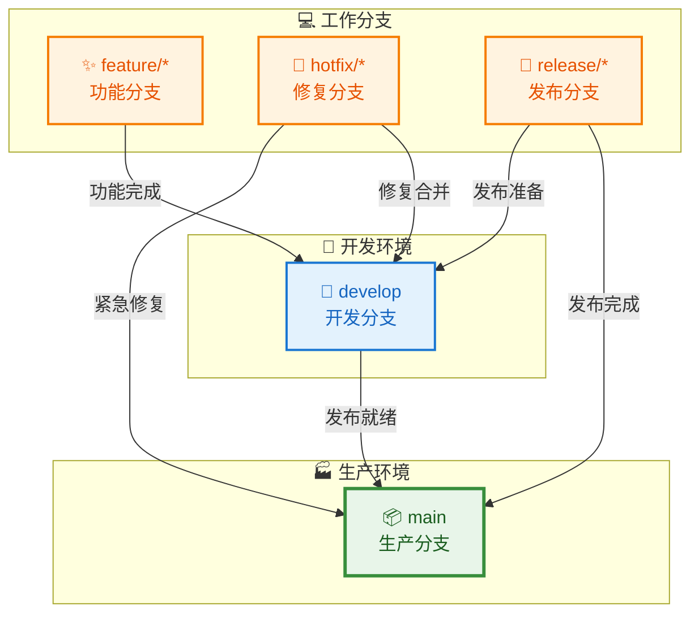

# EdgeVPN 版本控制策略

## 1. 概述

本文档定义了 EdgeVPN 项目的版本控制策略，包括分支管理策略、代码合并流程及版本号命名规则。良好的版本控制策略有助于团队协作、代码管理和版本发布。

## 2. 分支管理策略

### 2.1 分支模型

EdgeVPN 采用 Git Flow 分支模型，包含以下主要分支：



### 2.2 分支类型

#### 2.2.1 主分支（main）

- **用途**：生产环境代码
- **稳定性**：稳定，可随时部署
- **保护**：受保护，禁止直接推送
- **合并**：仅从 release 和 hotfix 分支合并

```bash
# 拉取最新代码
git checkout main
git pull origin main

# 查看主分支状态
git log --oneline -10
```

#### 2.2.2 开发分支（develop）

- **用途**：开发环境代码
- **稳定性**：相对稳定，包含已完成的功能
- **保护**：受保护，禁止直接推送
- **合并**：从 feature 和 release 分支合并

```bash
# 拉取最新代码
git checkout develop
git pull origin develop

# 查看开发分支状态
git log --oneline -10
```

#### 2.2.3 功能分支（feature/*）

- **用途**：开发新功能
- **命名**：`feature/功能描述`
- **来源**：从 develop 分支创建
- **合并**：合并到 develop 分支

```bash
# 创建功能分支
git checkout develop
git pull origin develop
git checkout -b feature/add-ipv6-support

# 开发功能
# ... 编写代码 ...

# 提交更改
git add .
git commit -m "feat(node): add IPv6 support"

# 推送到远程
git push -u origin feature/add-ipv6-support
```

#### 2.2.4 修复分支（hotfix/*）

- **用途**：修复生产环境的紧急问题
- **命名**：`hotfix/问题描述`
- **来源**：从 main 分支创建
- **合并**：合并到 main 和 develop 分支

```bash
# 创建修复分支
git checkout main
git pull origin main
git checkout -b hotfix/fix-memory-leak

# 修复问题
# ... 修复代码 ...

# 提交更改
git add .
git commit -m "fix(node): resolve memory leak in packet forwarding"

# 推送到远程
git push -u origin hotfix/fix-memory-leak
```

#### 2.2.5 发布分支（release/*）

- **用途**：准备发布新版本
- **命名**：`release/vX.Y.Z`
- **来源**：从 develop 分支创建
- **合并**：合并到 main 和 develop 分支

```bash
# 创建发布分支
git checkout develop
git pull origin develop
git checkout -b release/v1.0.0

# 准备发布
# ... 更新版本号、文档 ...

# 提交更改
git add .
git commit -m "chore(release): prepare for v1.0.0"

# 推送到远程
git push -u origin release/v1.0.0
```

### 2.3 分支保护规则

#### 2.3.1 主分支（main）保护

- 禁止直接推送
- 需要 Pull Request
- 至少 1 个审查通过
- 必须通过 CI 检查
- 必须通过测试

#### 2.3.2 开发分支（develop）保护

- 禁止直接推送
- 需要 Pull Request
- 至少 1 个审查通过
- 必须通过 CI 检查
- 必须通过测试

## 3. 代码合并流程

### 3.1 Pull Request 流程

#### 3.1.1 创建 Pull Request

1. **创建功能分支**
   ```bash
   git checkout -b feature/new-feature
   ```

2. **开发和提交**
   ```bash
   git add .
   git commit -m "feat: add new feature"
   git push -u origin feature/new-feature
   ```

3. **创建 Pull Request**
   - 在 GitHub 上创建 PR
   - 选择目标分支（develop 或 main）
   - 填写 PR 描述
   - 关联相关的 Issue

#### 3.1.2 PR 描述模板

```markdown
## 变更类型
- [ ] 新功能
- [ ] Bug 修复
- [ ] 文档更新
- [ ] 代码重构
- [ ] 性能优化
- [ ] 测试

## 变更说明
简要描述本次变更的内容和目的。

## 变更详情
- 添加了功能 X
- 修复了问题 Y
- 优化了性能 Z

## 测试
- [ ] 单元测试通过
- [ ] 集成测试通过
- [ ] 手动测试通过

## 相关 Issue
Closes #123

## 截图（如适用）
添加截图或 GIF 演示变更效果。

## 检查清单
- [ ] 代码遵循项目规范
- [ ] 添加了必要的测试
- [ ] 更新了相关文档
- [ ] 没有引入新的警告
```

#### 3.1.3 代码审查

1. **自动检查**
   - CI/CD 自动运行
   - 代码格式检查
   - 静态代码分析
   - 测试运行

2. **人工审查**
   - 至少一名维护者审查
   - 提出修改建议
   - 讨论技术方案

3. **修改和完善**
   - 根据反馈修改代码
   - 更新测试
   - 响应审查意见

#### 3.1.4 合并 Pull Request

1. **合并方式**
   - **Squash and merge**：推荐，保持历史清晰
   - **Merge commit**：保留完整历史
   - **Rebase and merge**：保持线性历史

2. **合并条件**
   - 所有审查通过
   - CI/CD 检查通过
   - 没有冲突

3. **合并后操作**
   - 删除功能分支
   - 更新本地仓库
   - 通知相关人员

```bash
# 删除远程分支
git push origin --delete feature/new-feature

# 删除本地分支
git branch -d feature/new-feature

# 更新本地仓库
git checkout develop
git pull origin develop
```

### 3.2 冲突解决

#### 3.2.1 识别冲突

```bash
# 拉取最新代码
git checkout develop
git pull origin develop

# 尝试合并
git merge feature/new-feature

# 如果有冲突，Git 会提示
```

#### 3.2.2 解决冲突

```bash
# 1. 查看冲突文件
git status

# 2. 编辑冲突文件
# 标记为冲突的文件会包含：
# <<<<<<< HEAD
# 当前分支的代码
# =======
# 合并分支的代码
# >>>>>>> feature/new-feature

# 3. 手动解决冲突
# 保留需要的代码，删除标记

# 4. 标记冲突已解决
git add <conflicted-file>

# 5. 完成合并
git commit

# 6. 推送更改
git push origin develop
```

#### 3.2.3 使用合并工具

```bash
# 使用 Git 内置合并工具
git mergetool

# 或使用外部工具
git config --global merge.tool vimdiff
git mergetool
```

## 4. 版本号命名规则

### 4.1 语义化版本（Semantic Versioning）

EdgeVPN 遵循语义化版本规范，版本号格式为：`MAJOR.MINOR.PATCH`

#### 4.1.1 版本号组成

| 部分 | 说明 | 示例 |
|------|------|------|
| MAJOR | 主版本号，不兼容的 API 修改 | 1.0.0 → 2.0.0 |
| MINOR | 次版本号，向下兼容的功能性新增 | 1.0.0 → 1.1.0 |
| PATCH | 修订号，向下兼容的问题修正 | 1.0.0 → 1.0.1 |

#### 4.1.2 版本号示例

```
v1.0.0 - 初始版本
v1.1.0 - 添加 IPv6 支持（功能新增）
v1.1.1 - 修复 DNS 解析问题（问题修正）
v2.0.0 - 重构 API 接口（不兼容修改）
```

### 4.2 预发布版本

#### 4.2.1 预发布标识符

| 标识符 | 说明 | 示例 |
|--------|------|------|
| alpha | 内部测试版本 | v1.0.0-alpha.1 |
| beta | 公开测试版本 | v1.0.0-beta.1 |
| rc | 候选发布版本 | v1.0.0-rc.1 |

#### 4.2.2 预发布版本示例

```
v1.0.0-alpha.1 - 第一个 alpha 版本
v1.0.0-alpha.2 - 第二个 alpha 版本
v1.0.0-beta.1 - 第一个 beta 版本
v1.0.0-rc.1 - 第一个候选版本
v1.0.0 - 正式版本
```

### 4.3 版本发布流程

#### 4.3.1 准备发布

```bash
# 1. 创建发布分支
git checkout develop
git pull origin develop
git checkout -b release/v1.0.0

# 2. 更新版本号
# 编辑 version.go 或相关文件
# 将版本号更新为 v1.0.0

# 3. 更新 CHANGELOG
# 添加版本发布说明

# 4. 提交更改
git add .
git commit -m "chore(release): prepare for v1.0.0"

# 5. 推送发布分支
git push -u origin release/v1.0.0
```

#### 4.3.2 测试发布

```bash
# 1. 构建发布版本
goreleaser build --clean --snapshot

# 2. 测试构建产物
./dist/edgevpn-v1.0.0-linux-amd64 --version

# 3. 运行集成测试
go test ./...
```

#### 4.3.3 合并发布

```bash
# 1. 合并到 main
git checkout main
git merge release/v1.0.0

# 2. 创建标签
git tag -a v1.0.0 -m "Release v1.0.0"

# 3. 推送标签
git push origin v1.0.0

# 4. 合并到 develop
git checkout develop
git merge release/v1.0.0

# 5. 推送更改
git push origin develop

# 6. 删除发布分支
git branch -d release/v1.0.0
git push origin --delete release/v1.0.0
```

#### 4.3.4 发布版本

```bash
# 使用 GoReleaser 发布
goreleaser release

# 或手动在 GitHub 上创建 Release
# 1. 访问 https://github.com/mudler/edgevpn/releases/new
# 2. 选择标签 v1.0.0
# 3. 填写发布说明
# 4. 上传构建产物
# 5. 发布
```

### 4.4 变更日志（CHANGELOG）

#### 4.4.1 变更日志格式

```markdown
# Changelog

All notable changes to this project will be documented in this file.

The format is based on [Keep a Changelog](https://keepachangelog.com/en/1.0.0/),
and this project adheres to [Semantic Versioning](https://semver.org/spec/v2.0.0.html).

## [Unreleased]

### Added
- 新功能描述

### Changed
- 变更描述

### Deprecated
- 废弃功能描述

### Removed
- 移除功能描述

### Fixed
- 修复问题描述

### Security
- 安全修复描述

## [1.0.0] - 2026-02-13

### Added
- 初始版本发布
- 支持 IPv4 和 IPv6
- P2P 网络功能
- 区块链账本
- DNS 解析服务

### Security
- 使用 TLS 加密通信
- 实现信任区域认证

[Unreleased]: https://github.com/mudler/edgevpn/compare/v1.0.0...HEAD
[1.0.0]: https://github.com/mudler/edgevpn/releases/tag/v1.0.0
```

#### 4.4.2 变更类型说明

| 类型 | 说明 |
|------|------|
| Added | 新增功能 |
| Changed | 功能变更 |
| Deprecated | 废弃功能 |
| Removed | 移除功能 |
| Fixed | 问题修复 |
| Security | 安全修复 |

## 5. Git 工作流

### 5.1 日常开发流程

#### 5.1.1 开始新功能

```bash
# 1. 更新本地仓库
git checkout develop
git pull origin develop

# 2. 创建功能分支
git checkout -b feature/new-feature

# 3. 开发功能
# ... 编写代码 ...

# 4. 提交更改
git add .
git commit -m "feat: add new feature"

# 5. 推送到远程
git push -u origin feature/new-feature
```

#### 5.1.2 提交代码

```bash
# 查看更改
git status

# 添加文件
git add <file>
git add .

# 提交
git commit -m "type(scope): description"

# 推送
git push
```

### 5.2 紧急修复流程

#### 5.2.1 创建修复分支

```bash
# 1. 从 main 创建修复分支
git checkout main
git pull origin main
git checkout -b hotfix/fix-critical-bug

# 2. 修复问题
# ... 修复代码 ...

# 3. 提交更改
git add .
git commit -m "fix: resolve critical bug"

# 4. 推送到远程
git push -u origin hotfix/fix-critical-bug
```

#### 5.2.2 合并修复

```bash
# 1. 合并到 main
git checkout main
git merge hotfix/fix-critical-bug

# 2. 创建标签
git tag -a v1.0.1 -m "Hotfix v1.0.1"

# 3. 推送标签
git push origin v1.0.1

# 4. 合并到 develop
git checkout develop
git merge hotfix/fix-critical-bug

# 5. 推送更改
git push origin develop

# 6. 删除修复分支
git branch -d hotfix/fix-critical-bug
git push origin --delete hotfix/fix-critical-bug
```

## 6. 提交规范

### 6.1 提交信息格式

使用约定式提交（Conventional Commits）格式：

```
<type>(<scope>): <subject>

<body>

<footer>
```

### 6.2 提交类型

| 类型 | 说明 |
|------|------|
| feat | 新功能 |
| fix | 修复 bug |
| docs | 文档更新 |
| style | 代码格式（不影响代码运行的变动） |
| refactor | 重构（既不是新增功能，也不是修改 bug 的代码变动） |
| perf | 性能优化 |
| test | 增加测试 |
| chore | 构建过程或辅助工具的变动 |
| ci | CI/CD 配置文件和脚本的变动 |
| revert | 回退先前的提交 |

### 6.3 提交示例

```bash
# 新功能
git commit -m "feat(node): add support for IPv6 addresses"

# 修复 bug
git commit -m "fix(blockchain): resolve race condition in ledger sync"

# 文档更新
git commit -m "docs(api): update API documentation for v2.0"

# 重构
git commit -m "refactor(services): simplify service registration logic"

# 性能优化
git commit -m "perf(vpn): reduce memory allocation in packet forwarding"

# 测试
git commit -m "test(node): add unit tests for node discovery"

# 构建
git commit -m "chore(deps): update libp2p to v0.30.0"

# CI/CD
git commit -m "ci(github): add workflow for automated testing"

# 回退
git commit -m "revert: revert commit abc1234"
```

### 6.4 提交最佳实践

- **原子提交**：每次提交只做一件事
- **清晰描述**：提交信息应该清晰描述变更
- **及时提交**：频繁提交，避免大量变更堆积
- **不要提交临时文件**：使用 .gitignore 排除临时文件
- **不要提交敏感信息**：不要提交密钥、密码等敏感信息

## 7. 分支命名规范

### 7.1 功能分支

```
feature/<feature-name>
```

示例：
- `feature/add-ipv6-support`
- `feature/implement-dns-forwarding`
- `feature/add-metrics-api`

### 7.2 修复分支

```
hotfix/<issue-description>
```

示例：
- `hotfix/fix-memory-leak`
- `hotfix/resolve-connection-timeout`
- `hotfix/fix-dns-resolution`

### 7.3 发布分支

```
release/vX.Y.Z
```

示例：
- `release/v1.0.0`
- `release/v1.1.0`
- `release/v2.0.0`

### 7.4 其他分支

- `docs/*` - 文档更新
- `refactor/*` - 代码重构
- `test/*` - 测试相关
- `ci/*` - CI/CD 配置

## 8. 版本回退

### 8.1 回退提交

```bash
# 回退单个提交（保留历史）
git revert <commit-hash>

# 回退多个提交
git revert <commit-hash1> <commit-hash2>

# 回退到指定提交（删除历史）
git reset --hard <commit-hash>
```

### 8.2 回退版本

```bash
# 删除远程标签
git push origin --delete v1.0.0

# 删除本地标签
git tag -d v1.0.0

# 创建新标签
git tag -a v1.0.1 -m "New release v1.0.1"

# 推送新标签
git push origin v1.0.1
```

## 9. 团队协作

### 9.1 代码审查

- 每个 PR 必须经过至少一人审查
- 审查者应该仔细检查代码质量
- 提供建设性的反馈
- 及时响应审查意见

### 9.2 冲突解决

- 尽早合并代码，减少冲突
- 及时解决冲突
- 与相关人员沟通
- 保持代码历史清晰

### 9.3 沟通协作

- 使用 Issue 跟踪问题和功能
- 使用 Pull Request 进行代码审查
- 使用 GitHub Discussions 进行讨论
- 定期同步进度

## 10. 工具和自动化

### 10.1 Git 钩子

#### 10.1.1 Pre-commit 钩子

```bash
#!/bin/sh
# .git/hooks/pre-commit

# 格式化代码
gofmt -w .
goimports -w .

# 运行 linter
golangci-lint run

# 运行测试
go test ./...
```

#### 10.1.2 Pre-push 钩子

```bash
#!/bin/sh
# .git/hooks/pre-push

# 运行完整测试套件
go test -race -cover ./...
```

### 10.2 自动化工具

#### 10.2.1 GitHub Actions

- 自动运行测试
- 自动构建和发布
- 自动检查代码质量
- 自动部署

#### 10.2.2 Dependabot

- 自动更新依赖
- 创建 PR 进行依赖更新
- 检查安全漏洞

## 11. 安全考虑

### 11.1 敏感信息

- 不要提交密钥、密码等敏感信息
- 使用环境变量管理敏感信息
- 使用 `.env` 文件（加入 .gitignore）
- 使用密钥管理系统

### 11.2 访问控制

- 使用 GitHub Teams 管理访问权限
- 限制主分支的写入权限
- 使用分支保护规则
- 审查代码合并

### 11.3 审计日志

- 记录所有代码变更
- 记录版本发布
- 记录安全事件
- 定期审计访问日志

## 12. 总结

遵循本版本控制策略有助于保持代码质量、提高团队协作效率并确保版本发布的稳定性。所有开发者都应该熟悉并遵守这些策略。
