# EdgeVPN 真实场景部署示例

## 1. 概述

本文档提供多种真实业务场景下的 EdgeVPN 部署示例，帮助用户根据实际需求选择合适的部署方案。每个场景包含详细的架构设计、部署步骤和配置示例。

## 2. 场景一：家庭办公 VPN 网络

### 2.1 场景描述

适用于远程办公场景，员工在家通过 EdgeVPN 安全访问公司内网资源，无需配置复杂的 VPN 服务器。

### 2.2 架构图

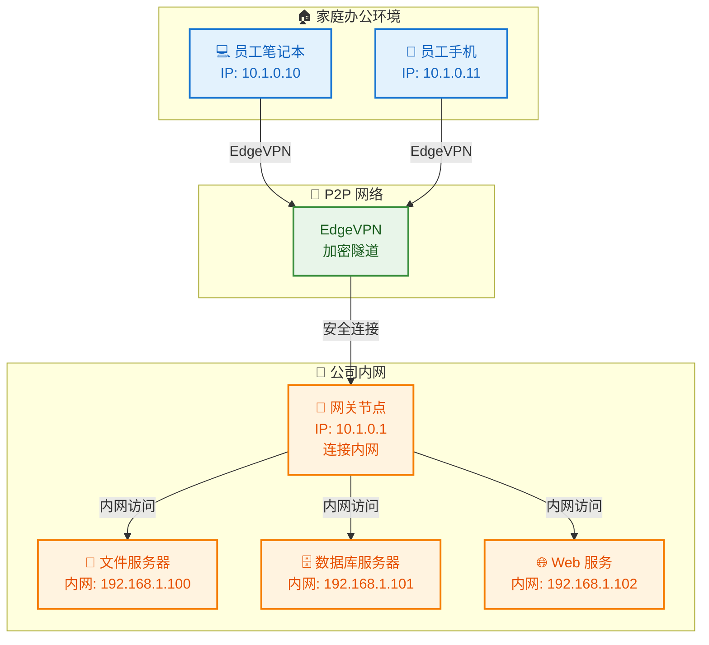

### 2.3 部署步骤

#### 步骤 1：生成网络令牌

```bash
# 在任意机器上生成令牌
edgevpn -g -b > edgevpn-token.txt

# 查看令牌内容
cat edgevpn-token.txt
```

#### 步骤 2：部署公司网关节点

```bash
# 创建配置文件
cat > /etc/edgevpn/config.yaml << 'EOF'
network:
  token: "你的令牌内容"
  address: "10.1.0.1/24"
  interface: "edgevpn0"
  interface_mtu: 1420

# 启用路由转发功能
routing:
  enabled: true
  forward_traffic: true

# 内网路由配置
routes:
  - destination: "192.168.1.0/24"
    gateway: "10.1.0.1"

logging:
  level: "info"
EOF

# 启动服务
sudo edgevpn --config /etc/edgevpn/config.yaml
```

#### 步骤 3：配置网关路由转发

```bash
# 启用 IP 转发
sudo sysctl -w net.ipv4.ip_forward=1

# 永久启用
echo "net.ipv4.ip_forward=1" | sudo tee -a /etc/sysctl.conf

# 配置 NAT（如果需要）
sudo iptables -t nat -A POSTROUTING -s 10.1.0.0/24 -o eth0 -j MASQUERADE

# 保存 iptables 规则
sudo iptables-save > /etc/iptables/rules.v4
```

#### 步骤 4：员工家庭节点配置

```bash
# 创建配置文件
cat > ~/.edgevpn/config.yaml << 'EOF'
network:
  token: "你的令牌内容"
  address: "10.1.0.10/24"
  interface: "edgevpn0"

# 添加内网路由
routes:
  - destination: "192.168.1.0/24"
    gateway: "10.1.0.1"

dns:
  enabled: true
  listen: ":53"
  forwarder: true
  forward:
    - "192.168.1.1:53"

logging:
  level: "info"
EOF

# 启动 EdgeVPN
edgevpn --config ~/.edgevpn/config.yaml
```

#### 步骤 5：验证连接

```bash
# 检查 VPN 接口
ifconfig edgevpn0

# 测试连接
ping 10.1.0.1

# 测试内网访问
ping 192.168.1.100

# 测试 Web 服务
curl http://192.168.1.102
```

### 2.4 配置说明

| 配置项 | 说明 |
|--------|------|
| `network.token` | 网络共享令牌，所有节点使用相同令牌 |
| `network.address` | VPN 虚拟 IP 地址，每个节点唯一 |
| `routing.enabled` | 启用路由转发功能 |
| `routes` | 配置静态路由，指向内网网段 |

### 2.5 注意事项

1. **安全性**：令牌应妥善保管，不要泄露给外部人员
2. **带宽**：家庭网络带宽可能有限，建议优化流量
3. **稳定性**：使用 systemd 服务保持长期运行
4. **DNS**：配置内网 DNS 服务器便于访问内网资源

---

## 3. 场景二：开发测试环境互联

### 3.1 场景描述

适用于开发团队，多个开发者的本地开发环境通过 EdgeVPN 互联，实现跨机器的服务调用和调试。

### 3.2 架构图

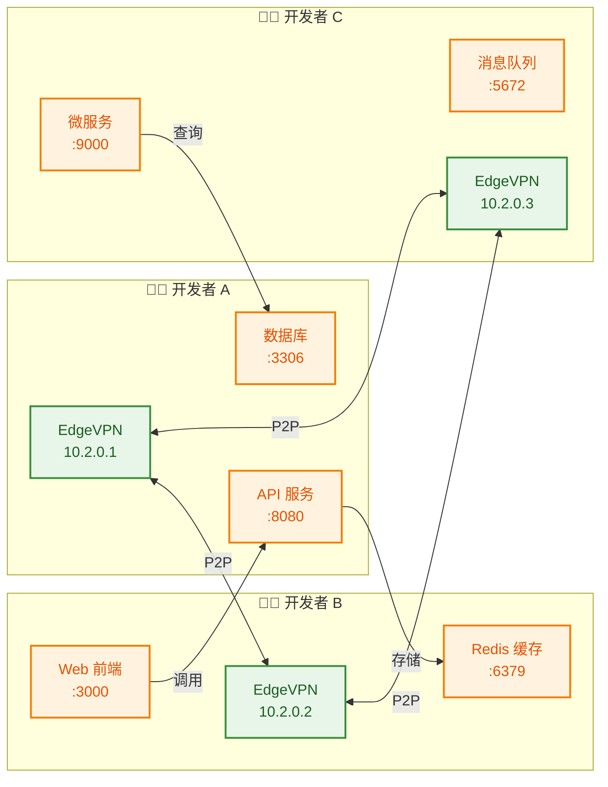

### 3.3 部署步骤

#### 步骤 1：创建开发网络令牌

```bash
# 生成开发环境专用令牌
edgevpn -g -b > dev-network-token.txt

# 将令牌分发给团队成员
# 通过安全渠道（如加密邮件、密码管理器）分享
```

#### 步骤 2：开发者 A 配置（API + 数据库）

```bash
# 创建配置
cat > ~/.edgevpn/dev-config.yaml << 'EOF'
network:
  token: "开发网络令牌"
  address: "10.2.0.1/24"
  interface: "edgevpn0"

# 启用 API 便于调试
api:
  enabled: true
  listen: "0.0.0.0:8080"

# DNS 服务
dns:
  enabled: true
  listen: ":5353"
  
  # 注册本地服务
  records:
    - pattern: "api.dev.local"
      type: "A"
      value: "10.2.0.1"
      ttl: 60
    - pattern: "db.dev.local"
      type: "A"
      value: "10.2.0.1"
      ttl: 60

# 服务注册
services:
  - name: "api-service"
    address: "10.2.0.1:8080"
  - name: "mysql-service"
    address: "10.2.0.1:3306"

logging:
  level: "debug"
EOF

# 启动
edgevpn --config ~/.edgevpn/dev-config.yaml
```

#### 步骤 3：开发者 B 配置（Web + Redis）

```bash
cat > ~/.edgevpn/dev-config.yaml << 'EOF'
network:
  token: "开发网络令牌"
  address: "10.2.0.2/24"
  interface: "edgevpn0"

dns:
  enabled: true
  listen: ":5353"
  records:
    - pattern: "web.dev.local"
      type: "A"
      value: "10.2.0.2"
      ttl: 60
    - pattern: "redis.dev.local"
      type: "A"
      value: "10.2.0.2"
      ttl: 60

services:
  - name: "web-frontend"
    address: "10.2.0.2:3000"
  - name: "redis-service"
    address: "10.2.0.2:6379"

logging:
  level: "debug"
EOF

edgevpn --config ~/.edgevpn/dev-config.yaml
```

#### 步骤 4：开发者 C 配置（微服务 + MQ）

```bash
cat > ~/.edgevpn/dev-config.yaml << 'EOF'
network:
  token: "开发网络令牌"
  address: "10.2.0.3/24"
  interface: "edgevpn0"

dns:
  enabled: true
  listen: ":5353"
  records:
    - pattern: "svc.dev.local"
      type: "A"
      value: "10.2.0.3"
      ttl: 60
    - pattern: "mq.dev.local"
      type: "A"
      value: "10.2.0.3"
      ttl: 60

services:
  - name: "microservice"
    address: "10.2.0.3:9000"
  - name: "rabbitmq"
    address: "10.2.0.3:5672"

logging:
  level: "debug"
EOF

edgevpn --config ~/.edgevpn/dev-config.yaml
```

#### 步骤 5：配置本地 DNS

```bash
# 配置系统使用 EdgeVPN DNS
# Linux
sudo resolvectl dns edgevpn0 127.0.0.1:5353

# macOS
sudo networksetup -setdnsservers "Wi-Fi" 127.0.0.1

# 或在应用配置中使用
# 例如 Web 应用配置
cat > web-app-config.json << 'EOF'
{
  "api_url": "http://api.dev.local:8080",
  "db_host": "db.dev.local",
  "redis_host": "redis.dev.local"
}
EOF
```

### 3.4 服务发现和调用

```bash
# 查看网络中的所有服务
curl http://localhost:8080/api/services

# 查看所有节点
curl http://localhost:8080/api/nodes

# 使用 DNS 名称访问服务
curl http://api.dev.local:8080/health
mysql -h db.dev.local -u root -p
redis-cli -h redis.dev.local ping
```

### 3.5 注意事项

1. **端口冲突**：确保本地服务端口不与 EdgeVPN 冲突
2. **DNS 配置**：所有开发者使用相同的 DNS 命名规范
3. **日志级别**：开发环境可使用 debug 级别便于排查问题
4. **服务注册**：定期更新服务注册信息

---

## 4. 场景三：多地域分布式团队协作

### 4.1 场景描述

适用于跨地域的分布式团队，不同地区的办公室通过 EdgeVPN 建立私有网络，实现资源共享和协同工作。

### 4.2 架构图

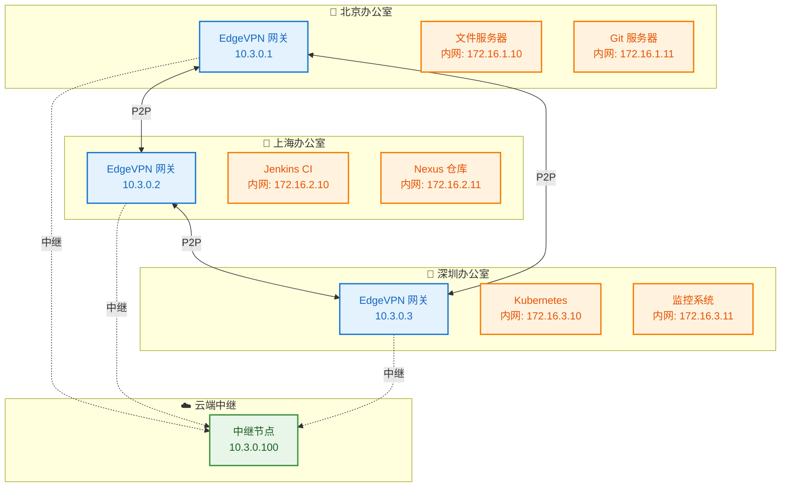

### 4.3 部署步骤

#### 步骤 1：部署云端中继节点

```bash
# 在云服务器上部署中继节点
cat > /etc/edgevpn/relay-config.yaml << 'EOF'
network:
  token: "分布式网络令牌"
  address: "10.3.0.100/24"
  interface: "edgevpn0"

# 中继配置
relay:
  enabled: true
  listen: "0.0.0.0:4001"

# 公网访问配置
nat:
  traversal: true
  stun_server: "stun.l.google.com:19302"

api:
  enabled: true
  listen: "0.0.0.0:8080"

logging:
  level: "info"
EOF

# 启动中继服务
edgevpn --config /etc/edgevpn/relay-config.yaml
```

#### 步骤 2：北京办公室网关配置

```bash
cat > /etc/edgevpn/beijing-config.yaml << 'EOF'
network:
  token: "分布式网络令牌"
  address: "10.3.0.1/24"
  interface: "edgevpn0"

# 引导节点（中继）
bootstrap:
  - "/ip4/云服务器公网IP/tcp/4001/p2p/中继节点PeerID"

# 路由配置
routing:
  enabled: true
  routes:
    - destination: "172.16.1.0/24"
      gateway: "10.3.0.1"
    - destination: "172.16.2.0/24"
      gateway: "10.3.0.2"
    - destination: "172.16.3.0/24"
      gateway: "10.3.0.3"

# NAT 穿透
nat:
  traversal: true
  upnp: true

dns:
  enabled: true
  listen: ":53"
  forwarder: true
  forward:
    - "114.114.114.114:53"

logging:
  level: "info"
EOF

edgevpn --config /etc/edgevpn/beijing-config.yaml
```

#### 步骤 3：上海办公室网关配置

```bash
cat > /etc/edgevpn/shanghai-config.yaml << 'EOF'
network:
  token: "分布式网络令牌"
  address: "10.3.0.2/24"
  interface: "edgevpn0"

bootstrap:
  - "/ip4/云服务器公网IP/tcp/4001/p2p/中继节点PeerID"

routing:
  enabled: true
  routes:
    - destination: "172.16.1.0/24"
      gateway: "10.3.0.1"
    - destination: "172.16.2.0/24"
      gateway: "10.3.0.2"
    - destination: "172.16.3.0/24"
      gateway: "10.3.0.3"

nat:
  traversal: true
  upnp: true

dns:
  enabled: true
  listen: ":53"
  forwarder: true

logging:
  level: "info"
EOF

edgevpn --config /etc/edgevpn/shanghai-config.yaml
```

#### 步骤 4：深圳办公室网关配置

```bash
cat > /etc/edgevpn/shenzhen-config.yaml << 'EOF'
network:
  token: "分布式网络令牌"
  address: "10.3.0.3/24"
  interface: "edgevpn0"

bootstrap:
  - "/ip4/云服务器公网IP/tcp/4001/p2p/中继节点PeerID"

routing:
  enabled: true
  routes:
    - destination: "172.16.1.0/24"
      gateway: "10.3.0.1"
    - destination: "172.16.2.0/24"
      gateway: "10.3.0.2"
    - destination: "172.16.3.0/24"
      gateway: "10.3.0.3"

nat:
  traversal: true
  upnp: true

dns:
  enabled: true
  listen: ":53"
  forwarder: true

logging:
  level: "info"
EOF

edgevpn --config /etc/edgevpn/shenzhen-config.yaml
```

#### 步骤 5：配置办公室内网路由

```bash
# 在各办公室的内网路由器上添加路由
# 北京办公室
ip route add 10.3.0.0/24 via 10.3.0.1
ip route add 172.16.2.0/24 via 10.3.0.2
ip route add 172.16.3.0/24 via 10.3.0.3

# 上海办公室
ip route add 10.3.0.0/24 via 10.3.0.2
ip route add 172.16.1.0/24 via 10.3.0.1
ip route add 172.16.3.0/24 via 10.3.0.3

# 深圳办公室
ip route add 10.3.0.0/24 via 10.3.0.3
ip route add 172.16.1.0/24 via 10.3.0.1
ip route add 172.16.2.0/24 via 10.3.0.2
```

### 4.4 跨地域访问示例

```bash
# 北京访问上海 Jenkins
curl http://172.16.2.10:8080

# 上海访问北京 Git
git clone http://172.16.1.11/project.git

# 深圳访问北京文件服务器
scp user@172.16.1.10:/data/file.txt ./

# 所有办公室访问深圳监控
http://172.16.3.11:3000
```

### 4.5 注意事项

1. **网络延迟**：跨地域连接可能有较高延迟，建议优化应用
2. **带宽成本**：跨地域流量会产生带宽成本，需要监控
3. **时区同步**：确保所有服务器时区配置正确
4. **备份策略**：重要数据需要跨地域备份

---

## 5. 场景四：IoT 设备互联

### 5.1 场景描述

适用于物联网场景，大量 IoT 设备通过 EdgeVPN 安全互联，实现设备管理和数据采集。

### 5.2 架构图

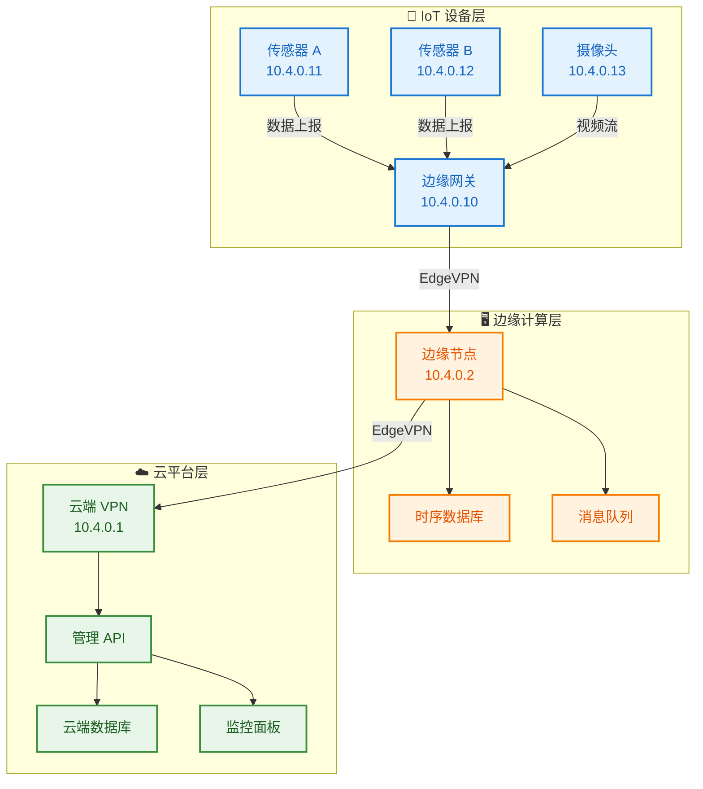

### 5.3 部署步骤

#### 步骤 1：云端管理节点配置

```bash
cat > /etc/edgevpn/cloud-config.yaml << 'EOF'
network:
  token: "IoT 网络令牌"
  address: "10.4.0.1/24"
  interface: "edgevpn0"

# 高可用配置
high_availability:
  enabled: true
  max_connections: 500
  max_streams: 100

# API 服务
api:
  enabled: true
  listen: "0.0.0.0:8080"

# DNS 服务
dns:
  enabled: true
  listen: ":53"
  
  # IoT 设备 DNS 记录
  records:
    - pattern: "*.iot.local"
      type: "A"
      value: "10.4.0.1"
      ttl: 60

# 信任区域（仅允许授权设备）
trustzone:
  enabled: true
  auth_method: "ecdsa"
  authorized_keys:
    - "设备公钥列表"

logging:
  level: "warn"
EOF

edgevpn --config /etc/edgevpn/cloud-config.yaml
```

#### 步骤 2：边缘节点配置

```bash
cat > /etc/edgevpn/edge-config.yaml << 'EOF'
network:
  token: "IoT 网络令牌"
  address: "10.4.0.2/24"
  interface: "edgevpn0"

# 引导节点
bootstrap:
  - "/ip4/云端IP/tcp/4001/p2p/云端PeerID"

# 资源限制（边缘设备资源有限）
limits:
  max_connections: 100
  max_streams: 30
  bandwidth_limit: "10MB/s"

# 数据转发
forwarding:
  enabled: true
  upstream: "10.4.0.1:8080"

# 本地缓存
cache:
  enabled: true
  size: "100MB"

logging:
  level: "warn"
EOF

edgevpn --config /etc/edgevpn/edge-config.yaml
```

#### 步骤 3：IoT 网关配置

```bash
cat > /etc/edgevpn/gateway-config.yaml << 'EOF'
network:
  token: "IoT 网络令牌"
  address: "10.4.0.10/24"
  interface: "edgevpn0"

# 低功耗模式
power_save:
  enabled: true
  sleep_interval: "30s"

# 数据批量上报
batch:
  enabled: true
  size: 100
  interval: "60s"

# 本地存储（离线缓存）
storage:
  enabled: true
  path: "/var/lib/edgevpn/cache"
  max_size: "1GB"

# 服务注册
services:
  - name: "iot-gateway"
    address: "10.4.0.10:1883"  # MQTT
  - name: "iot-data"
    address: "10.4.0.10:8080"

logging:
  level: "error"
EOF

edgevpn --config /etc/edgevpn/gateway-config.yaml
```

#### 步骤 4：IoT 设备配置（传感器）

```bash
# 嵌入式设备配置（简化版）
cat > /etc/edgevpn/sensor-config.yaml << 'EOF'
network:
  token: "IoT 网络令牌"
  address: "10.4.0.11/24"
  interface: "edgevpn0"

# 最小资源配置
limits:
  max_connections: 10
  max_streams: 5

# 心跳上报
heartbeat:
  enabled: true
  interval: "300s"
  target: "10.4.0.10"

# 数据上报
data_report:
  enabled: true
  target: "10.4.0.10:1883"
  topic: "sensors/data"
  interval: "60s"

logging:
  level: "error"
EOF

edgevpn --config /etc/edgevpn/sensor-config.yaml
```

### 5.4 设备管理 API

```bash
# 查看所有 IoT 设备
curl http://10.4.0.1:8080/api/machines

# 查看设备状态
curl http://10.4.0.1:8080/api/nodes

# 发送命令到设备
curl -X POST http://10.4.0.1:8080/api/send \
  -d '{"peer_id": "设备PeerID", "command": "reboot"}'

# 查看设备数据
curl http://10.4.0.1:8080/api/data/sensors
```

### 5.5 注意事项

1. **设备认证**：启用信任区域防止未授权设备接入
2. **资源限制**：IoT 设备资源有限，需要合理配置
3. **离线缓存**：设备离线时需要本地缓存数据
4. **批量上报**：减少网络开销，使用批量数据上报
5. **安全更新**：定期更新设备固件和 EdgeVPN 版本

---

## 6. 场景五：安全文件共享

### 6.1 场景描述

适用于需要安全共享文件的场景，通过 EdgeVPN 建立的加密通道传输敏感文件，无需依赖第三方云存储。

### 6.2 架构图

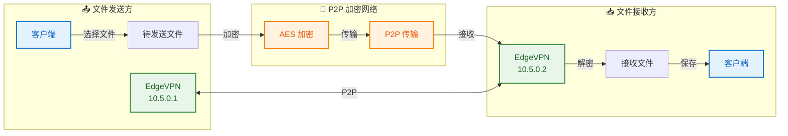

### 6.3 部署步骤

#### 步骤 1：发送方配置

```bash
cat > ~/.edgevpn/fileshare-config.yaml << 'EOF'
network:
  token: "文件共享令牌"
  address: "10.5.0.1/24"
  interface: "edgevpn0"

# 文件共享配置
fileshare:
  enabled: true
  shared_dir: "/home/user/shared"
  max_file_size: "1GB"
  
# 信任区域
trustzone:
  enabled: true
  auth_method: "ecdsa"
  public_key: "发送方公钥"
  authorized_keys:
    - "接收方公钥"

logging:
  level: "info"
EOF

edgevpn --config ~/.edgevpn/fileshare-config.yaml
```

#### 步骤 2：接收方配置

```bash
cat > ~/.edgevpn/fileshare-config.yaml << 'EOF'
network:
  token: "文件共享令牌"
  address: "10.5.0.2/24"
  interface: "edgevpn0"

fileshare:
  enabled: true
  download_dir: "/home/user/downloads"
  auto_accept: false  # 手动确认接收

trustzone:
  enabled: true
  auth_method: "ecdsa"
  public_key: "接收方公钥"
  authorized_keys:
    - "发送方公钥"

logging:
  level: "info"
EOF

edgevpn --config ~/.edgevpn/fileshare-config.yaml
```

#### 步骤 3：发送文件

```bash
# 方式一：使用命令行
edgevpn file send \
  --file /path/to/sensitive.doc \
  --peer "接收方PeerID" \
  --timeout 300s

# 方式二：使用 API
curl -X POST http://localhost:8080/api/file/send \
  -F "file=@/path/to/sensitive.doc" \
  -F "peer_id=接收方PeerID"

# 方式三：共享文件目录
# 将文件放入共享目录，自动公告
cp sensitive.doc /home/user/shared/
```

#### 步骤 4：接收文件

```bash
# 查看可用文件列表
edgevpn file list

# 接收指定文件
edgevpn file receive \
  --file-id "文件ID" \
  --output /home/user/downloads/

# 或使用 API
curl http://localhost:8080/api/files

curl -X POST http://localhost:8080/api/file/receive \
  -d '{"file_id": "文件ID", "output_path": "/home/user/downloads/"}'
```

### 6.4 文件传输流程

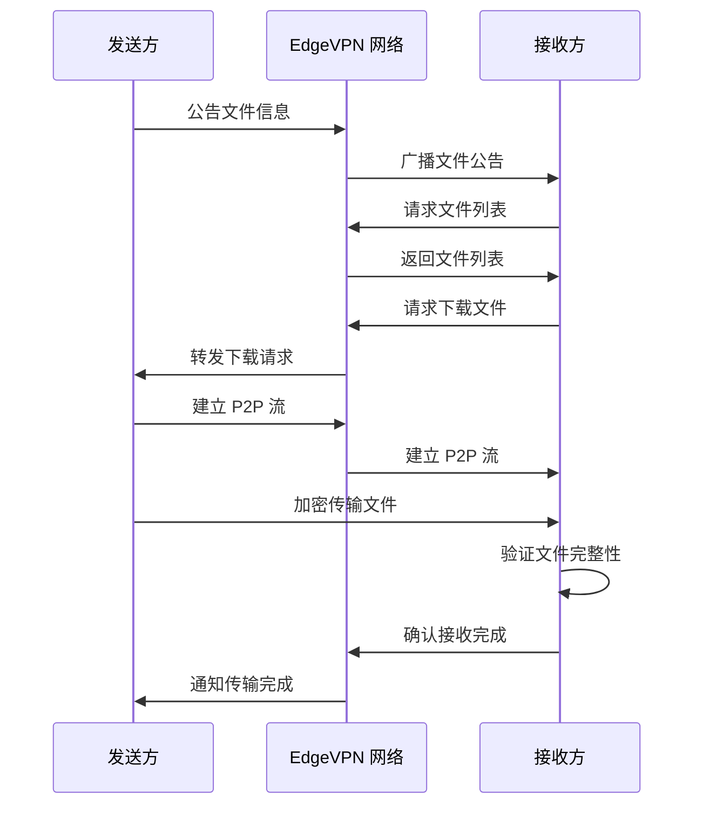

### 6.5 注意事项

1. **文件大小**：大文件传输需要较长时间，建议分片传输
2. **断点续传**：支持断点续传，网络中断后可继续传输
3. **完整性校验**：传输完成后自动校验文件哈希
4. **访问控制**：启用信任区域确保只有授权用户可以访问
5. **日志审计**：记录所有文件传输操作

---

## 7. 场景六：微服务互联

### 7.1 场景描述

适用于微服务架构，多个微服务实例通过 EdgeVPN 互联，实现服务发现、负载均衡和故障转移。

### 7.2 架构图

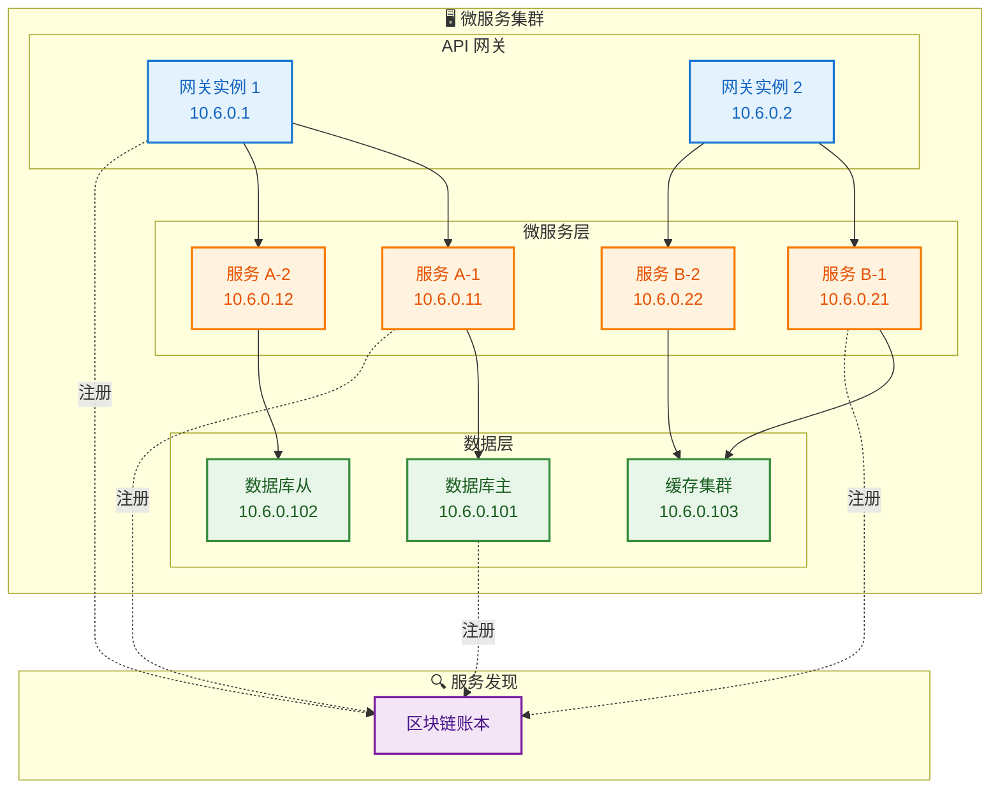

### 7.3 部署步骤

#### 步骤 1：API 网关配置

```bash
cat > /etc/edgevpn/gateway-config.yaml << 'EOF'
network:
  token: "微服务网络令牌"
  address: "10.6.0.1/24"
  interface: "edgevpn0"

# 服务注册
services:
  - name: "api-gateway"
    address: "10.6.0.1:8080"
    tags: ["gateway", "api", "public"]
    health_check: "/health"
    health_interval: "30s"

# 负载均衡
load_balancing:
  enabled: true
  algorithm: "round_robin"
  health_check: true

# 服务发现
discovery:
  enabled: true
  refresh_interval: "10s"

# API 配置
api:
  enabled: true
  listen: "0.0.0.0:8080"

logging:
  level: "info"
EOF

edgevpn --config /etc/edgevpn/gateway-config.yaml
```

#### 步骤 2：微服务 A 配置

```bash
cat > /etc/edgevpn/service-a-config.yaml << 'EOF'
network:
  token: "微服务网络令牌"
  address: "10.6.0.11/24"
  interface: "edgevpn0"

services:
  - name: "service-a"
    address: "10.6.0.11:9001"
    tags: ["service", "backend"]
    health_check: "/health"
    
# 依赖服务
dependencies:
  - name: "database"
    required: true
  - name: "cache"
    required: false

# 熔断配置
circuit_breaker:
  enabled: true
  threshold: 5
  timeout: "30s"

logging:
  level: "info"
EOF

edgevpn --config /etc/edgevpn/service-a-config.yaml
```

#### 步骤 3：数据库配置

```bash
cat > /etc/edgevpn/database-config.yaml << 'EOF'
network:
  token: "微服务网络令牌"
  address: "10.6.0.101/24"
  interface: "edgevpn0"

services:
  - name: "database"
    address: "10.6.0.101:3306"
    tags: ["database", "mysql", "primary"]
    
  - name: "database-read"
    address: "10.6.0.102:3306"
    tags: ["database", "mysql", "replica"]

# 访问控制
trustzone:
  enabled: true
  allowed_services:
    - "service-a"
    - "service-b"

logging:
  level: "warn"
EOF

edgevpn --config /etc/edgevpn/database-config.yaml
```

### 7.4 服务调用示例

```bash
# 查看所有服务
curl http://10.6.0.1:8080/api/services

# 查看服务实例
curl http://10.6.0.1:8080/api/services/service-a

# 健康检查
curl http://10.6.0.11:9001/health

# 服务调用（通过网关）
curl http://10.6.0.1:8080/api/v1/resource

# 直接调用服务
curl http://10.6.0.11:9001/api/resource
```

### 7.5 注意事项

1. **服务注册**：服务启动后自动注册到区块链账本
2. **健康检查**：定期检查服务健康状态，自动剔除不健康实例
3. **负载均衡**：网关自动负载均衡到多个服务实例
4. **故障转移**：服务实例故障时自动切换到其他实例
5. **访问控制**：使用信任区域限制服务访问权限

---

## 8. 场景七：边缘计算网络

### 8.1 场景描述

适用于边缘计算场景，在靠近数据源的位置部署计算节点，通过 EdgeVPN 实现边缘节点与云端的协同计算。

### 8.2 架构图

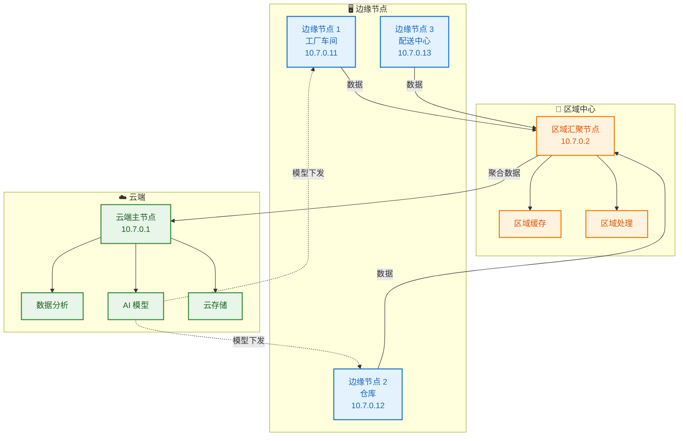

### 8.3 部署步骤

#### 步骤 1：云端主节点配置

```bash
cat > /etc/edgevpn/cloud-master-config.yaml << 'EOF'
network:
  token: "边缘计算网络令牌"
  address: "10.7.0.1/24"
  interface: "edgevpn0"

# 高可用配置
high_availability:
  enabled: true
  max_connections: 200

# 数据汇聚配置
aggregation:
  enabled: true
  batch_size: 1000
  flush_interval: "30s"

# AI 模型分发
model_distribution:
  enabled: true
  model_dir: "/opt/models"
  version_control: true

# 任务调度
scheduler:
  enabled: true
  algorithm: "resource_aware"
  node_selection: "latency_based"

api:
  enabled: true
  listen: "0.0.0.0:8080"

logging:
  level: "info"
EOF

edgevpn --config /etc/edgevpn/cloud-master-config.yaml
```

#### 步骤 2：区域汇聚节点配置

```bash
cat > /etc/edgevpn/region-hub-config.yaml << 'EOF'
network:
  token: "边缘计算网络令牌"
  address: "10.7.0.2/24"
  interface: "edgevpn0"

# 引导节点
bootstrap:
  - "/ip4/云端IP/tcp/4001/p2p/云端PeerID"

# 数据缓存
cache:
  enabled: true
  type: "redis"
  address: "localhost:6379"
  ttl: "1h"

# 本地处理
processing:
  enabled: true
  workers: 4
  queue_size: 1000

# 数据转发
forwarding:
  enabled: true
  upstream: "10.7.0.1:8080"
  batch_size: 100
  interval: "10s"

logging:
  level: "info"
EOF

edgevpn --config /etc/edgevpn/region-hub-config.yaml
```

#### 步骤 3：边缘节点配置

```bash
cat > /etc/edgevpn/edge-node-config.yaml << 'EOF'
network:
  token: "边缘计算网络令牌"
  address: "10.7.0.11/24"
  interface: "edgevpn0"

bootstrap:
  - "/ip4/区域中心IP/tcp/4001/p2p/区域PeerID"

# 边缘计算配置
edge_compute:
  enabled: true
  gpu: true
  memory: "4GB"
  
# 本地推理
inference:
  enabled: true
  model_path: "/opt/models/current"
  batch_size: 10
  
# 数据采集
data_collection:
  enabled: true
  sources:
    - type: "sensor"
      endpoint: "/dev/ttyUSB0"
      interval: "1s"
    - type: "camera"
      endpoint: "rtsp://camera.local/stream"
      fps: 30

# 离线模式
offline:
  enabled: true
  cache_size: "10GB"
  sync_interval: "5m"

# 资源限制
limits:
  cpu: "80%"
  memory: "4GB"
  bandwidth: "5MB/s"

logging:
  level: "warn"
EOF

edgevpn --config /etc/edgevpn/edge-node-config.yaml
```

### 8.4 任务调度示例

```bash
# 提交计算任务
curl -X POST http://10.7.0.1:8080/api/tasks \
  -d '{
    "name": "image-recognition",
    "model": "yolov5",
    "target_nodes": ["edge"],
    "priority": "high"
  }'

# 查看任务状态
curl http://10.7.0.1:8080/api/tasks/task-id

# 查看边缘节点状态
curl http://10.7.0.1:8080/api/nodes

# 下发 AI 模型
curl -X POST http://10.7.0.1:8080/api/models/deploy \
  -d '{
    "model": "yolov5-v2",
    "target": "10.7.0.11"
  }'
```

### 8.5 注意事项

1. **资源管理**：边缘节点资源有限，需要合理分配
2. **离线能力**：边缘节点需要支持离线运行
3. **模型更新**：支持增量更新和版本管理
4. **数据安全**：敏感数据在边缘处理，减少云端传输
5. **延迟优化**：选择最近的节点进行计算

---

## 9. 场景八：灾难恢复网络

### 9.1 场景描述

适用于灾难恢复场景，在主数据中心故障时，通过 EdgeVPN 快速切换到备用数据中心，确保业务连续性。

### 9.2 架构图

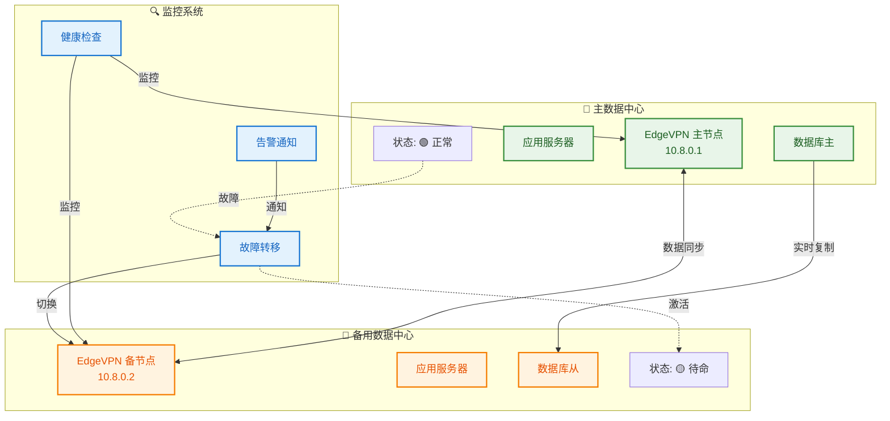

### 9.3 部署步骤

#### 步骤 1：主数据中心配置

```bash
cat > /etc/edgevpn/primary-config.yaml << 'EOF'
network:
  token: "灾难恢复网络令牌"
  address: "10.8.0.1/24"
  interface: "edgevpn0"

# 高可用配置
high_availability:
  enabled: true
  role: "primary"
  priority: 100
  
# 健康检查
health_check:
  enabled: true
  interval: "10s"
  timeout: "5s"
  endpoints:
    - "/health"
    - "/ready"
    - "/live"

# 数据同步
sync:
  enabled: true
  target: "10.8.0.2"
  mode: "realtime"
  
# 故障转移配置
failover:
  enabled: true
  auto_failover: true
  threshold: 3
  cooldown: "60s"

# 监控配置
monitoring:
  enabled: true
  metrics: true
  alerting: true
  alert_endpoints:
    - "webhook:https://alert.example.com/webhook"
    - "email:ops@example.com"

api:
  enabled: true
  listen: "0.0.0.0:8080"

logging:
  level: "info"
EOF

edgevpn --config /etc/edgevpn/primary-config.yaml
```

#### 步骤 2：备用数据中心配置

```bash
cat > /etc/edgevpn/backup-config.yaml << 'EOF'
network:
  token: "灾难恢复网络令牌"
  address: "10.8.0.2/24"
  interface: "edgevpn0"

# 引导节点
bootstrap:
  - "/ip4/主数据中心IP/tcp/4001/p2p/主节点PeerID"

high_availability:
  enabled: true
  role: "backup"
  priority: 50

# 数据同步（接收端）
sync:
  enabled: true
  mode: "replica"
  
# 故障转移配置
failover:
  enabled: true
  auto_promote: true
  health_check_interval: "5s"
  
# 待命模式
standby:
  enabled: true
  resources: "minimal"
  
# 监控配置
monitoring:
  enabled: true
  alerting: true

api:
  enabled: true
  listen: "0.0.0.0:8080"

logging:
  level: "info"
EOF

edgevpn --config /etc/edgevpn/backup-config.yaml
```

#### 步骤 3：监控系统配置

```bash
cat > /etc/edgevpn/monitor-config.yaml << 'EOF'
network:
  token: "灾难恢复网络令牌"
  address: "10.8.0.100/24"
  interface: "edgevpn0"

# 监控配置
monitoring:
  enabled: true
  targets:
    - address: "10.8.0.1"
      name: "primary"
      interval: "5s"
    - address: "10.8.0.2"
      name: "backup"
      interval: "5s"

# 告警规则
alerting:
  rules:
    - name: "primary_down"
      condition: "ping_failed > 3"
      action: "failover"
      severity: "critical"
      
    - name: "high_latency"
      condition: "latency > 1000ms"
      action: "alert"
      severity: "warning"

# 故障转移策略
failover_policy:
  auto: true
  confirmation: false  # 是否需要人工确认
  rollback: true
  rollback_timeout: "5m"

api:
  enabled: true
  listen: "0.0.0.0:8080"

logging:
  level: "info"
EOF

edgevpn --config /etc/edgevpn/monitor-config.yaml
```

### 9.4 故障转移操作

```bash
# 查看当前状态
curl http://10.8.0.100:8080/api/ha/status

# 手动触发故障转移
curl -X POST http://10.8.0.100:8080/api/ha/failover \
  -d '{"reason": "maintenance", "confirm": true}'

# 查看故障转移历史
curl http://10.8.0.100:8080/api/ha/history

# 回滚到主数据中心
curl -X POST http://10.8.0.100:8080/api/ha/rollback

# 查看告警历史
curl http://10.8.0.100:8080/api/alerts
```

### 9.5 注意事项

1. **数据同步**：确保主备数据实时同步
2. **健康检查**：配置合理的健康检查间隔和阈值
3. **自动切换**：谨慎配置自动故障转移，避免误切换
4. **回滚机制**：支持故障恢复后的回滚操作
5. **定期演练**：定期进行灾难恢复演练

---

## 10. 场景九：安全审计网络

### 10.1 场景描述

适用于需要严格安全审计的场景，通过 EdgeVPN 建立安全审计网络，记录所有网络活动和访问日志。

### 10.2 架构图

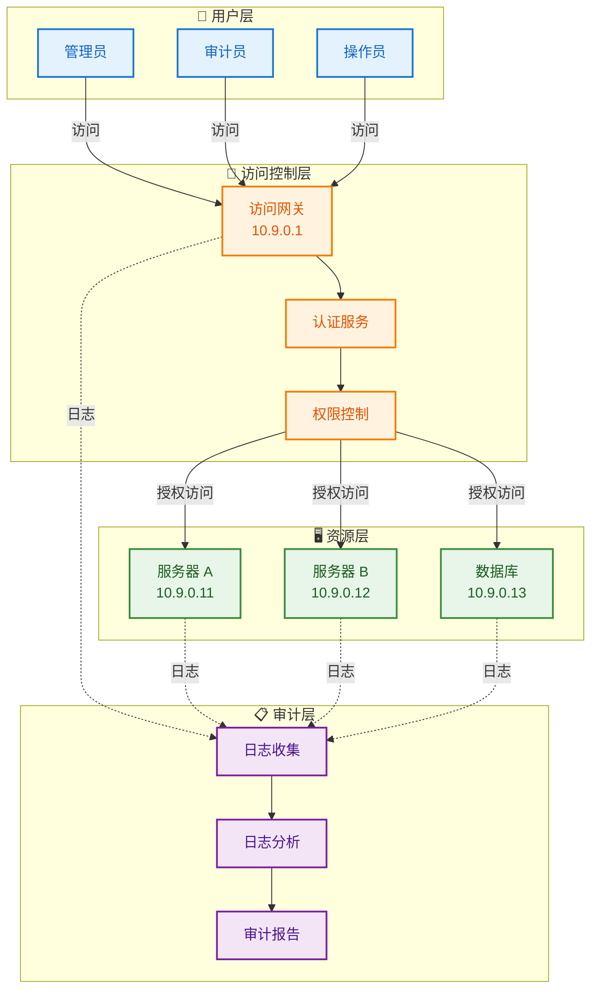

### 10.3 部署步骤

#### 步骤 1：访问网关配置

```bash
cat > /etc/edgevpn/audit-gateway-config.yaml << 'EOF'
network:
  token: "审计网络令牌"
  address: "10.9.0.1/24"
  interface: "edgevpn0"

# 访问控制
access_control:
  enabled: true
  auth_method: "ecdsa"
  
  # 用户权限配置
  users:
    - id: "admin"
      role: "administrator"
      permissions: ["*"]
    - id: "auditor"
      role: "auditor"
      permissions: ["read", "audit"]
    - id: "operator"
      role: "operator"
      permissions: ["read", "execute"]

# 审计配置
audit:
  enabled: true
  log_all: true
  log_level: "detailed"
  
  # 审计日志存储
  storage:
    type: "elasticsearch"
    address: "http://elasticsearch:9200"
    index: "edgevpn-audit"
    
  # 敏感操作记录
  sensitive_operations:
    - "file_transfer"
    - "configuration_change"
    - "user_management"
    - "access_control_change"

# 会话管理
session:
  timeout: "8h"
  max_sessions: 10
  concurrent_limit: 3

api:
  enabled: true
  listen: "0.0.0.0:8080"

logging:
  level: "info"
EOF

edgevpn --config /etc/edgevpn/audit-gateway-config.yaml
```

#### 步骤 2：资源服务器配置

```bash
cat > /etc/edgevpn/audit-server-config.yaml << 'EOF'
network:
  token: "审计网络令牌"
  address: "10.9.0.11/24"
  interface: "edgevpn0"

# 访问控制
trustzone:
  enabled: true
  allowed_roles:
    - "administrator"
    - "operator"

# 审计日志
audit:
  enabled: true
  
  # 操作记录
  operations:
    - type: "ssh"
      log_commands: true
    - type: "file"
      log_access: true
    - type: "database"
      log_queries: true
      
  # 日志转发
  forward:
    enabled: true
    target: "10.9.0.1:8080"
    batch_size: 100
    interval: "10s"

# 资源限制
limits:
  max_connections: 50
  rate_limit: "100/min"

logging:
  level: "info"
EOF

edgevpn --config /etc/edgevpn/audit-server-config.yaml
```

### 10.4 审计操作示例

```bash
# 查看审计日志
curl http://10.9.0.1:8080/api/audit/logs \
  -H "Authorization: Bearer $TOKEN"

# 查看用户活动
curl http://10.9.0.1:8080/api/audit/users/admin/activity

# 查看敏感操作
curl http://10.9.0.1:8080/api/audit/sensitive

# 生成审计报告
curl -X POST http://10.9.0.1:8080/api/audit/report \
  -d '{
    "start": "2024-01-01T00:00:00Z",
    "end": "2024-01-31T23:59:59Z",
    "type": "monthly"
  }'

# 查看访问统计
curl http://10.9.0.1:8080/api/audit/statistics
```

### 10.5 注意事项

1. **日志完整性**：确保审计日志不可篡改
2. **日志备份**：定期备份审计日志
3. **访问控制**：严格控制审计日志的访问权限
4. **合规要求**：根据行业合规要求配置审计策略
5. **性能影响**：审计功能可能影响系统性能，需要平衡

---

## 11. 场景十：混合云网络

### 11.1 场景描述

适用于混合云场景，将本地数据中心与公有云资源通过 EdgeVPN 互联，实现统一的网络管理。

### 11.2 架构图

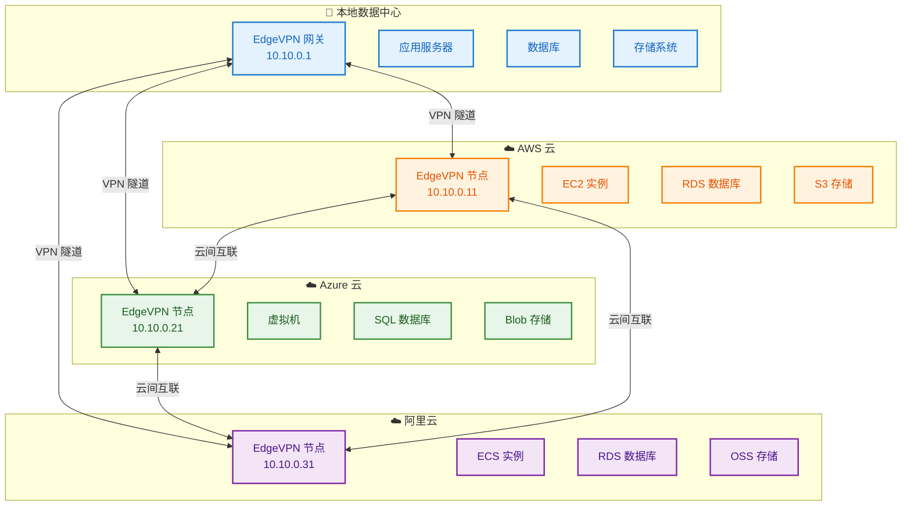

### 11.3 部署步骤

#### 步骤 1：本地数据中心网关配置

```bash
cat > /etc/edgevpn/onprem-config.yaml << 'EOF'
network:
  token: "混合云网络令牌"
  address: "10.10.0.1/24"
  interface: "edgevpn0"

# 多云路由配置
routing:
  enabled: true
  routes:
    - destination: "10.10.0.0/24"
      gateway: "10.10.0.1"
    - destination: "172.31.0.0/16"  # AWS VPC
      gateway: "10.10.0.11"
    - destination: "10.0.0.0/16"    # Azure VNet
      gateway: "10.10.0.21"
    - destination: "192.168.0.0/16" # 阿里云 VPC
      gateway: "10.10.0.31"

# NAT 穿透
nat:
  traversal: true
  stun_server: "stun.l.google.com:19302"

# 高可用
high_availability:
  enabled: true
  failover_nodes:
    - "10.10.0.2"

api:
  enabled: true
  listen: "0.0.0.0:8080"

logging:
  level: "info"
EOF

edgevpn --config /etc/edgevpn/onprem-config.yaml
```

#### 步骤 2：AWS 云节点配置

```bash
cat > /etc/edgevpn/aws-config.yaml << 'EOF'
network:
  token: "混合云网络令牌"
  address: "10.10.0.11/24"
  interface: "edgevpn0"

# 引导节点
bootstrap:
  - "/ip4/本地数据中心IP/tcp/4001/p2p/本地PeerID"

# AWS 特定配置
cloud:
  provider: "aws"
  region: "us-east-1"
  
# VPC 路由
routing:
  enabled: true
  routes:
    - destination: "172.31.0.0/16"
      gateway: "10.10.0.11"
    - destination: "10.10.0.0/24"
      gateway: "10.10.0.1"

# 服务发现
services:
  - name: "aws-api"
    address: "10.10.0.11:8080"
    tags: ["aws", "api"]

logging:
  level: "info"
EOF

edgevpn --config /etc/edgevpn/aws-config.yaml
```

#### 步骤 3：Azure 云节点配置

```bash
cat > /etc/edgevpn/azure-config.yaml << 'EOF'
network:
  token: "混合云网络令牌"
  address: "10.10.0.21/24"
  interface: "edgevpn0"

bootstrap:
  - "/ip4/本地数据中心IP/tcp/4001/p2p/本地PeerID"

cloud:
  provider: "azure"
  region: "eastus"

routing:
  enabled: true
  routes:
    - destination: "10.0.0.0/16"
      gateway: "10.10.0.21"
    - destination: "10.10.0.0/24"
      gateway: "10.10.0.1"

services:
  - name: "azure-api"
    address: "10.10.0.21:8080"
    tags: ["azure", "api"]

logging:
  level: "info"
EOF

edgevpn --config /etc/edgevpn/azure-config.yaml
```

#### 步骤 4：阿里云节点配置

```bash
cat > /etc/edgevpn/aliyun-config.yaml << 'EOF'
network:
  token: "混合云网络令牌"
  address: "10.10.0.31/24"
  interface: "edgevpn0"

bootstrap:
  - "/ip4/本地数据中心IP/tcp/4001/p2p/本地PeerID"

cloud:
  provider: "aliyun"
  region: "cn-hangzhou"

routing:
  enabled: true
  routes:
    - destination: "192.168.0.0/16"
      gateway: "10.10.0.31"
    - destination: "10.10.0.0/24"
      gateway: "10.10.0.1"

services:
  - name: "aliyun-api"
    address: "10.10.0.31:8080"
    tags: ["aliyun", "api"]

logging:
  level: "info"
EOF

edgevpn --config /etc/edgevpn/aliyun-config.yaml
```

### 11.4 混合云操作示例

```bash
# 查看所有云节点
curl http://10.10.0.1:8080/api/nodes

# 从本地访问 AWS 资源
curl http://172.31.0.10:8080/api

# 从 AWS 访问本地资源
ssh user@10.10.0.1

# 跨云数据传输
# AWS 到 Azure
scp user@172.31.0.10:/data/file.txt user@10.0.0.10:/backup/

# 查看路由表
curl http://10.10.0.1:8080/api/routes
```

### 11.5 注意事项

1. **网络延迟**：跨云访问延迟较高，需要优化应用
2. **带宽成本**：跨云流量成本较高，需要监控和控制
3. **安全配置**：确保各云平台的安全组配置正确
4. **数据合规**：注意数据跨境传输的合规要求
5. **故障隔离**：单云故障不应影响其他云的正常运行

---

## 12. 总结

本文档提供了十种真实业务场景下的 EdgeVPN 部署示例，涵盖了：

1. **家庭办公**：远程安全访问公司内网
2. **开发测试**：多开发者环境互联
3. **多地域协作**：跨地域分布式团队协作
4. **IoT 互联**：物联网设备安全互联
5. **文件共享**：安全文件传输和共享
6. **微服务**：微服务架构的服务发现和负载均衡
7. **边缘计算**：边缘节点与云端协同计算
8. **灾难恢复**：主备数据中心故障转移
9. **安全审计**：网络访问审计和日志记录
10. **混合云**：多云环境统一网络管理

每个场景都提供了详细的架构设计、部署步骤和配置示例，用户可以根据实际需求选择合适的部署方案，并根据示例进行调整和优化。
